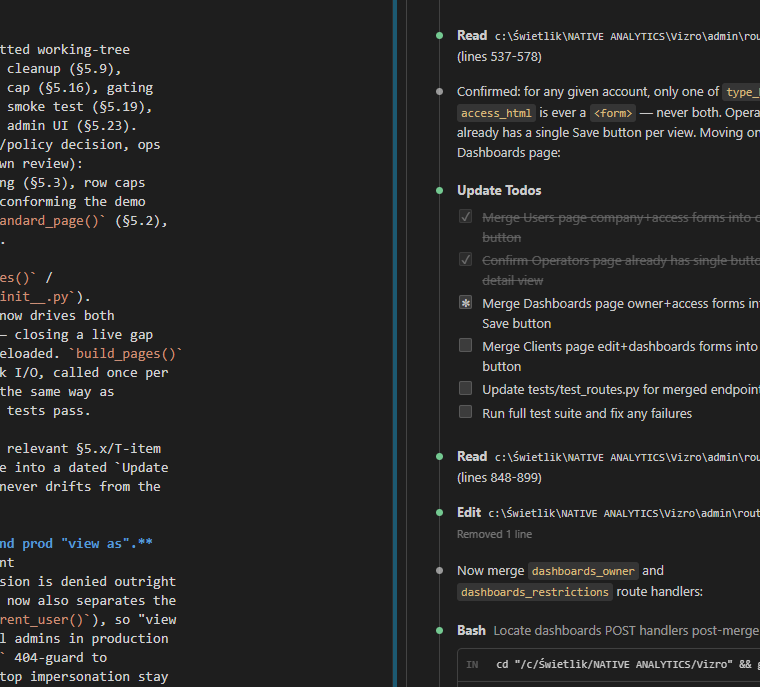

# Native Analytics / Amazon 2026 Architecture Improvement Plan

> Living architecture document. Verified against the working tree on 2026-06-25 by direct reads,
> `rg`, and a full `pytest` run. Anchors are **file paths, module/function names, component ids,
> config keys, and test names** — not line numbers, which drift. A short "Audit notes" appendix
> records the few line references used as evidence at time of writing; treat those as volatile.
>
> Scope: the `amazon_2026` dashboard plus the shared platform code it runs on (`app.py`,
> `config.py`, `dashboards/_base.py`, `dashboards/__init__.py`, `data_sources/bq.py`, `tenancy/*`,
> `auth/*`, `extensions/*`, `pages_landing/*`).
>
> **Update (2026-06-25): a batch of small, low-risk fixes has landed** (uncommitted working-tree
> changes). Done: the navigation rebuild (§5.1, §5.22), all tracked dev-residue cleanup (§5.9),
> `set_dev_mode` gating (§5.10), preload timing logs (§5.12), the BigQuery byte cap (§5.16), gating
> demo dashboards out of prod (§5.18, gate half only), the `amazon_2026` render smoke test (§5.19),
> HTTP response compression (§5.20), and making the operator role usable in the admin UI (§5.23).
> 61 tests pass. **Deliberately left for later** (each needs either a team cost/policy decision, ops
> access this pass didn't have, or touches enough surface area to warrant its own review):
> `--min-instances=1` (§5.7), the `amazon` `Client` record + BigQuery IAM scoping (§5.3), row caps
> on the two unbounded queries (§5.5), the error/empty-state boundary (§5.17), conforming the demo
> dashboards' `charts.py`/`data.py` structure (§5.18's heavier half), `build_standard_page()` (§5.2),
> separating UI build from cache warmup (§5.13), and the rest of Tier 2–4 below.
>
> **Update (2026-06-27): §5.13 + §5.14 landed together** (same code: `build_pages()` /
> `_register_data_sources()` / `_start_preload()` in `dashboards/amazon_2026/__init__.py`).
> Registration collapsed to one `_LOADERS: dict[str, Callable]` mapping, which now drives both
> `data_manager` registration and cache warmup, so the two can no longer drift — closing a live gap
> where `DISCOVER_ITEMS_KEY`/`ARCHIVE_SCATTER_KEY` were registered but never preloaded. `build_pages()`
> is now pure (page construction only); the new `warm_caches()` does the network I/O, called once per
> process from `app.py` after pages are built. The optional hook is discovered the same way as
> `data_health` (`dashboards/__init__.py::RegisteredDashboard.warm_caches`). 64 tests pass.
>
> **Standing rule: update this plan after every implementation pass.** Mark the relevant §5.x/T-item
> done with a one-line status header (matching the style above), fold the change into a dated `Update
> (YYYY-MM-DD): ...` paragraph here, and refresh §2/§7's tables so the roadmap never drifts from the
> code. Do this every time, not just for batches that "feel big."
>
> **Update (2026-06-27): part of §5.24/T3.4 landed — user suspend, role-edit, and prod "view as".**
> `User.disabled` (`tenancy/models.py`) is enforced at the single auth chokepoint
> (`auth/middleware.py::_load_user_from_request`): a disabled account's own session is denied outright
> (redirect to login), independent of the dev/prod code path. The same function now also separates the
> *real* authenticated principal (`real_user()`) from the *effective* one (`current_user()`), so "view
> as" — previously hard-gated to dev (`AUTH_ENABLED=false`) — now works for real admins in production
> too: `/dev`, `/dev/as/<uid>`, `/dev/exit` moved from a `settings.auth_enabled` 404-guard to
> `real_admin_required` (checks the real identity, so the controls that start/stop impersonation stay
> reachable *while* impersonating a non-admin — `admin_required` alone would have locked that out, since
> the effective identity loses admin powers during impersonation, correctly, everywhere else). Resolves
> Open Question #5 (§10): staff impersonation in prod is approved, admin-only, and audited
> (`user.impersonate_start`, attributed to the real admin via `record_audit(..., actor=real_user())` so
> switching targets mid-session doesn't misattribute). Impersonating another admin or a disabled account
> is refused at both the route and the middleware. The Users page (`admin/routes.py`) gained a role
> `<select>`, a Suspend/Reactivate button, and a "View as" link per row. **Still open in §5.24:**
> delegated client-admin, broader audit coverage (logins/403s), client edit/delete, table
> search/pagination. 68 tests pass.
>
> **Update (2026-06-27): §5.17 partially landed (the observability half); §5.5 rejected outright —
> standing rule added.** `charts_shared.py::safe_load()` now logs (`logger.exception`) before
> returning an empty frame, so a real BigQuery failure no longer renders identically to "no data" —
> closing the gap where `safe_query()`'s deliberate prod-raise (§4) was being silently swallowed one
> layer up. `app.py::create_app` gained a dependency-free `@server.errorhandler(500)` (no
> template/auth lookup, so the error page itself can't fail mid-outage). **Still open in §5.17:**
> distinguishing "load failed" from "genuinely empty" in the UI message itself — that needs a flag
> threaded through every `_add_empty_figure_annotation` call site, correctly sized for its own pass.
> Separately, §5.5 (capping `load_archive_scatter` / `load_narrative_top_publishers`) was raised and
> **rejected**: the standing rule going forward is **never truncate queried data** — no `LIMIT`/row cap
> is acceptable on a query whose result a user is meant to see or whose output could feed a total. This
> does **not** apply to deliberate "Top N" leaderboard displays (`data_publishers.py`,
> `data_topic_areas.py`, `data_campaigns.py`'s `rn <= 50`; `data_overview.py`'s `LIMIT 250`) — those are
> intentionally a ranked top-N by design, not data hidden from a user expecting the full set, and stay
> as-is. Audited as part of this pass: none of those existing "Top N" frames currently feed a
> `.sum()`/total/percentage/KPI anywhere in `charts_*.py` — all totals trace to separate, uncapped
> aggregate queries. Worth a guardrail test later if that separation ever feels at risk. 70 tests pass.
>
> **Update (2026-06-27): §5.2 + §5.4 landed together** (deliberately bundled — both touch the same
> five page modules, so doing them in one pass avoids two separate edit passes over the same files).
> §5.2: a `build_standard_page()` factory (`pages/_shared.py`) now builds every page's `vm.Page(...)`
> skeleton (`id`/`title`/`path`/default `layout`) from `slug`/`display_name`/`ref_code`, applied to
> all 7 `build_*_page()` functions; only `components`/`controls` (and Overview's `path` override,
> Archive's `layout=None` override) still vary per page. §5.4: `charts_shared.py` (2.7k lines) is
> deleted and split into `theme.py` (pure design tokens/palettes, no internal deps), `timeline_charts.py`
> (the PCHIP/flag-annotation/dynamic-height geometry engine, plus the Trad/SoMe source-selection
> helpers timeline figures are always called alongside — `normalize_sources` moved here, not
> `ui_components.py`, specifically to keep the dependency direction acyclic), and `ui_components.py`
> (Dash UI builders, the table toolkit, and small generic data helpers like `safe_load`/`json_safe`).
> Dependency direction is one-way: `theme.py` → `timeline_charts.py` → `ui_components.py`. Every
> importer (7 `charts_*.py` modules, the same 5 `pages/*.py` modules from §5.2, 3 test files,
> `STYLE_GUIDE.md`, one `native_analytics.css` comment) was repointed to the correct new module — no
> re-export shim. Verified: a name-by-name AST cross-check that all 134 top-level names in the old
> file landed in exactly one new file, `pytest` green (70 tests, unchanged count — no tests added,
> only import paths and two AST-loader `Path(...)` literals in `test_amazon_2026_publishers.py`
> updated), and a repo-wide `charts_shared` grep clean except historical docstring/comment mentions.
>
> **Update (2026-06-27): T1.1/§5.1 corrected — the first nav pass had the wrong shape, found and
> fixed same day.** That pass (one `NavLink` per dashboard + CSS) put pages inside a secondary expand
> panel instead of the icon rail itself — not the desired UX, and not what was asked for. Corrected:
> one `NavLink` per *page* again (direct icon-click navigation, no expand panel), with a new
> `app.py::ScopedNavBar(vm.NavBar)` filtering the rendered icons to the active dashboard, computed
> server-side, fresh on every page render, from `active_page_id` — confirmed against Vizro's source
> that `Dashboard._make_page_layout` calls `navigation.build(active_page_id=page.id)` on every page
> route, not once at startup, so there's no "shows everything, narrows down after a click" window for
> the original bug (every dashboard's pages visible at once on first load) to live in. Falls back to
> an *empty* rail, never "show everything", when the active dashboard can't be determined. Restored
> the per-page `PAGE_ICONS`/`RegisteredDashboard.page_icons` plumbing deleted in the first pass.
> New `tests/test_navigation.py` (5 cases) asserts the rail's exact contents per dashboard, the
> empty-fallback safety property, and that no dashboard's pages ever appear under another's active
> page. 75 tests pass. Full writeup in §5.1.
>
> **Update (2026-06-27): §5.24/T3.4 client lifecycle landed (edit + delete), bundled because it's
> the same shape of work in the same place as the already-shipped user lifecycle.** The Clients page
> (`admin/routes.py`) gained an edit form (name/`bq_dataset`/brand/accent, mirroring the user
> role/suspend forms) and a Delete button, wired to new `clients_edit` / `clients_delete` routes.
> `tenancy/users.py::UserStore` gained `delete_client` (mirroring `delete_user`) on both backends.
> Deletion is guarded, not soft: refused (silent no-op) while any user's `client_id` still points at
> that client, so an admin must reassign them first rather than the platform silently orphaning a
> company link — no `archived` flag was added, since nothing here needs an undo/restore flow. Also
> **resolves Open Question #4 (§10): no delegated client-admin** — confirmed companies don't manage
> their own accounts, so the existing operator role (§5.23, already shipped) is the right level of
> delegation; this is closed outright, not deferred. **Still open in §5.24:** broader audit coverage
> (logins/403s, operator dashboard opens — lives in `app.py`'s access gate, not this file) and table
> search/pagination. 76 tests pass.
>
> **Update (2026-06-27): §5.17/T1.6 closed — the UI now distinguishes a swallowed load failure from
> a genuinely empty result, everywhere `_add_empty_figure_annotation` is shown.** `safe_load()` tags
> the empty frame it returns after an exception with `.attrs["load_failed"]`; every figure builder
> that can reach an ambiguous empty state now shows "Data temporarily unavailable" instead of its
> normal "no data" message when that tag (or an explicit `load_failed` flag/dict-key, for the
> `dcc.Store`-backed timeline/sentiment panels where `.attrs` doesn't survive the
> `.to_dict("records")` round-trip) is set. `_archive_figure` (the UMAP scatter) needed no change —
> every call site loads via Vizro's own `data_manager` binding, which already raises on failure
> rather than swallowing it. Full file-by-file detail in §5.17. Also **investigated T3.2** (redundant
> per-page BigQuery scans): found 6 genuine candidate pairs, but merging each needs a small
> shared-cache wrapper (so two `data_manager` keys don't double-run one merged query) plus
> BigQuery-verified output — not available in this environment — so implementation stays open;
> findings recorded under T3.2. 79 tests pass.
>
> **Update (2026-06-27): §7.1 Batch 3 landed — admin panel audit coverage + table search/pagination,
> and the §5.25/T3.5 CSS-extraction half that shares the same files.** Closes the rest of §5.24/T3.4:
> `auth/middleware.py::admin_required`/`real_admin_required` now record an `access.denied_admin` audit
> event (target = the denied path) before returning 403; `app.py`'s access gate records
> `access.denied_dashboard` (target = slug) the same way (operator dashboard opens were already
> covered by the existing `dashboard.cross_client_open` event from §5.23/T2.6 — nothing new needed
> there). `pages_landing/routes.py::session_login` records `auth.login` (target = uid) on every
> successful sign-in, attributed to the signing-in principal via an explicit `actor=` (a
> `SimpleNamespace(uid, email)` from the verified token claims, since the session cookie isn't set on
> the request that mints it, so `current_user()` can't resolve an actor yet). The Users page
> (`admin/routes.py`) takes `?q=` filtering the roster by email/uid before grouping by company; the
> Audit page takes `?q=` (actor/action/target/detail) and `?page=` (50/page, clamped past the end
> rather than erroring). The Usage page was deliberately left alone — it's one row per dashboard, not
> per event, so it's already small at any client count and pagination there would solve a
> non-problem. Separately, §5.25/T3.5(a): the two inline `<style>` blocks in `pages_landing/shell.py`
> and `pages_landing/routes.py` moved into one new `assets/native_analytics_shell.css`, linked via
> `<link rel="stylesheet">` (only the per-request dynamic accent-color override stays inline, since
> it's templated). To avoid adding this as a fourth always-on-every-dashboard-page CSS file —
> exactly the problem §5.25's own second bullet names — `app.py`'s `Vizro(...)` now passes
> `assets_ignore=r"native_analytics_shell\.css"`, which excludes it from Dash's automatic per-page
> injection while it's still served as a static file at the same asset URL, so landing/admin pages get
> a cacheable stylesheet without taxing dashboard pages that never use it. `admin/routes.py`'s own
> inline `<style>` (three `.status-*` rules) was deleted outright, not moved — it was dead duplication
> of rules the shell CSS already defines globally. Verified: `pytest` green (83 tests, 4 new in
> `tests/test_routes.py`: two confirming the new 403 audit events, two confirming the search/pagination
> behavior). The `auth.login` call has no dedicated test — mocking the Firebase Admin SDK end to end
> for one log line wasn't judged worth the harness weight; existing `session_login` tests already
> cover its status-code contract. §5.25's (b)/(c)/(d) (orphan-asset audit, experimental-chartmenu
> gating, token/minification pass) and the rest of §7.1's batches remain open.
>
> **Update (2026-06-28): §7.1 Batch 1's first half landed — T2.7/§5.26 (Discover keyword search
> quality); T4.7/§5.27 (semantic vector search) still open, ops-gated.** `charts_discover.py` gained
> a normalization/ranking layer: `_normalize_text()` (NFKD diacritic stripping + casefold + punctuation
> strip + whitespace collapse), `_stem_token()` (English plural-only suffix stripping — no verb
> stemming, kept deliberately narrow to avoid false matches), and a per-record `_search_index`
> (title/summary/metadata/full-text token sets) precomputed once in `discover_records()` so repeated
> filter callbacks don't re-tokenize the same records. `_search_rank()` replaces the old
> substring-only `_record_matches_search()` with 5 tiers (0 = exact phrase in title, 1 = all tokens in
> title+summary, 2 = all tokens incl. metadata — `Journalist`/`Topic_Area`/`Narrative`/`Media_Type`/
> `Source` were already present in the Discover record contract from `data_discover.py`, just unused by
> search — 3 = all tokens incl. full-text when the toggle is on, 4 = restrained fuzzy via
> `difflib.SequenceMatcher`, gated to tokens ≥4 chars and a 0.82 ratio so short common words can't
> fuzzy-broaden). `filter_discover_records()` now sorts by rank when a query is present (stable, so
> same-tier results keep their original date-desc order) instead of just pass/fail filtering; hard
> filters (source/sentiment/publisher/topic/narrative/date/selection/similarity) are unchanged and still
> apply on top. **Skipped from §5.26's direction list:** (5) UI snippet highlighting / "matched in X"
> hint — would need a table-column change in `discover_split_table_data()`/`build_top_*_table()`, sized
> for its own pass rather than bundled here; ranking already makes relevance visible via row order. (6)
> BigQuery `SEARCH` backend — the plan's own text says not to do this until in-memory ranking is proven.
> T4.7/§5.27 (embeddings/`VECTOR_SEARCH`) also landed the same day, once the user supplied the
> `OPENAI_API_KEY` (now in `.env`/`config.py::openai_api_key`) and confirmed the live `embedding`
> column via `bq query`: `STRING` holding a JSON array of 1536 floats (matches `text-embedding-3-small`'s
> native dimension) in both `amazon_2026_trad` and `amazon_2026_some` — not BigQuery's native
> `ARRAY<FLOAT64>`, confirming §5.27's own anticipated "if stored as JSON/string" branch.
> `VECTOR_SEARCH` itself turned out to reject **both** a logical view and any function/expression
> column in its base-table argument ("Columns with functions or nested field expressions are not
> allowed"), discovered by trial against the live project — so the typed-vector exposure had to be a
> materialized `TABLE` (`amazon_2026_discover_vectors`, a one-time `CREATE OR REPLACE TABLE ... AS
> SELECT` casting the JSON-string column via `SPLIT`+`CAST`), not the view originally planned;
> rerun that CTAS (documented next to `data_common.py::DISCOVER_VECTORS_TABLE`) whenever the
> underlying Trad/SoMe data or embeddings are refreshed. The stable item id (§5.27 direction #2) is
> `f"{Source}:{Record_ID}"` — `Record_ID` is unique within `amazon_2026_trad` (10359/10359) but has a
> handful of true duplicate rows within `amazon_2026_some` (2122/2197 distinct); both candidate rows
> are simply treated as the same semantic match, judged not worth more engineering for ~75 rows.
> `data_discover.py` now selects `Record_ID` into both `trad_items`/`some_items`; `charts_discover.py`
> computes `_stable_id` per record in `discover_records()`. `_embed_query()` calls OpenAI's
> `/v1/embeddings` directly via `requests` (no new SDK — direct HTTP is simpler than the `openai`
> package for one endpoint); `_vector_search()` runs a parameterized `VECTOR_SEARCH` query through a
> new `data_sources/bq.py::run_query_params()` (an `ArrayQueryParameter` for the 1536-float query
> vector, rather than string-interpolating it). `semantic_discover_candidates(query)` wraps both behind
> a TTL'd, lock-guarded cache keyed by normalized query text (mirrors the existing Discover server
> cache's double-checked pattern) so repeated non-search filter changes on an unchanged search box
> don't re-call OpenAI/BigQuery, and degrades to `{}` (keyword search still works, per the guardrail)
> on a missing key, an embedding-call failure, or a `VECTOR_SEARCH` failure — each independently
> tested. `filter_discover_records()` gained a `semantic_scores` parameter: records with no lexical
> hit fall through to a semantic check and rank at tier 5 (below every lexical tier 0-4, ordered by
> similarity), still subject to every hard filter; passing `None`/`{}` reproduces the old lexical-only
> behavior exactly (tested). `pages/discover.py`'s two filter callbacks fetch
> `semantic_discover_candidates(search_text)` and pass it straight through. **No vector index** was
> added — `VECTOR_SEARCH` runs a brute-force scan, fine at the live row count (12,556 — `amazon_2026`
> is nowhere near index territory), matching §5.27's "consider only after stable" guidance.
> **Skipped, per §5.27's own scope:** UI "semantic match" labeling (item #7) — the keyword-search pass
> already deferred the equivalent "matched in X" UI work for the same table-column reason; revisit
> both together. Verified beyond `pytest`: a live run against the real OpenAI key and the real
> `amazon_2026_discover_vectors` table found Polish-language antitrust articles for an English query
> sharing zero literal words with them — the exact vocabulary-mismatch case this section exists to
> solve. Verified: `pytest` green (104 tests, 9 new for keyword search + 10 new in
> `tests/test_amazon_2026_discover_semantic_search.py` for the embedding/vector-search fallback paths
> and hybrid ranking/hard-filter interaction).
>
> **Update (2026-06-27): §7.1 Batch 5 landed — two of its three items as code, one as an ops note.**
> T4.1/§5.8 (shared cache backend): `app.py::create_app()` now builds the Flask-Caching config from a
> new `config.py::cache_redis_url` setting — `RedisCache` when it's set, the unchanged `SimpleCache`
> default otherwise — so moving to a shared Memorystore cache once concurrency rises is one env var,
> not a code change. `redis` was added to `requirements.txt` (lazily imported by `flask_caching` only
> when the URL is actually set, so it's a no-op dependency for every deployment that leaves it empty).
> T4.3/§5.11 (chat provider): `extensions/chat_with_data.py` gained `_provider_amazon_2026()`, sourcing
> `NARRATIVES_KEY` (the groupable per-narrative frame) and `OVERVIEW_KPI_KEY` (a single totals row,
> folded into the text label) via `data_manager` — aggregated keys only, never the raw
> `amazon_2026_trad`/`amazon_2026_some` tables. T4.2/§5.8 (Firestore usage-event TTL) turned out **not
> to need application code at all**: `usage_events` already has the `created_at` timestamp field a
> Firestore TTL policy targets, so the entire fix is one `gcloud firestore fields ttl-policies create`
> command against the live store — left **still open**, since this pass has no GCP console/CLI access
> (the same constraint already noted for T1.3's `Client` record). A scheduled application-level rollup
> was considered as an alternative and rejected: with no Cloud Scheduler wired to call it, that code
> would have no caller yet — scaffolding, not a present fix. Verified: `pytest` green (84 tests, 1 new
> — `test_chat_endpoint_covers_amazon_2026`).
>
> **Update (2026-06-28): §7.1 Batch 4 landed (T2.4/§5.18 conform half — closed); Batch 2's T3.2
> rejected outright, also closed.** Batch 4: the top-level `charts.py`/`data.py` (synthetic Amazon
> media dataset shared by `breakdown`/`timeline`) are deleted; each of those two dashboards now has
> its own self-contained `data.py`/`charts.py` (`bq_sample` already had its own), registering a
> zero-arg loader via `data_manager` and passing the string key to figure builders
> (`figure=narrative_reach_bar(data_frame=DATA_KEY)`) — matching `amazon_2026`'s convention instead of
> a literal module-level DataFrame built once at import. The synthetic-data generator is duplicated
> once per package rather than shared cross-package — deliberate, since the plugin model is "drop a
> package, restart" with no inter-package imports, and both are throwaway demo dashboards. Each
> loader now re-seeds `np.random` on every call so cache-TTL refreshes reproduce the same series
> instead of drifting. `extensions/chat_with_data.py`'s `_provider_timeline`/`_provider_breakdown`
> (importing the old top-level `data` module directly) were repointed to the new per-package loaders
> — caught by the existing chat-fallback test. T3.2 (consolidate the 6 redundant-shaped
> trad/some BigQuery query pairs across campaigns/narratives/topic_areas) was re-investigated with
> live BigQuery access (not available when first investigated) and **rejected**: each pair queries
> two different tables, `data_manager` already caches each independently, so there's no live
> double-scan bug — merging into one `UNION ALL` query would not reduce bytes scanned/billed, only
> collapse 2 round-trips into 1 (low hundreds of ms at this data volume), not enough to justify
> normalizing 6 mismatched column shapes plus a new shared TTL-cache wrapper plus live-BigQuery
> verification. New standing rule: don't merge same-shape queries across different source tables for
> round-trip count alone — only when it also cuts bytes scanned/billed. Verified: `pytest` green (104
> tests, no new tests for Batch 4 — pure refactor covered by existing routes/build tests).
>
> **Update (2026-06-28): schema-drift candidate lists replaced with verified single column names; new
> standing rule against name-guessing.** Queried the live `INFORMATION_SCHEMA` for
> `amazon_2026_trad`/`amazon_2026_some`/`amazon_2026_publishers`/`amazon_2026_angles`/
> `amazon_2026_narratives` directly against BigQuery and resolved every `*_CANDIDATES` list in
> `data_common.py`, plus every inline candidate list in the `data_*.py` modules, down to the one name
> actually present. `_table_column_map`/`_optional_*_expr`/`prime_schema_cache` are kept (the
> TRIM/NULLIF/CAST safety wrapping is still useful), but they're no longer fed lists of guesses.
> **Found and fixed 4 live bugs** where the old candidate never matched the real schema, so a field
> silently rendered empty/zero: `TRAD_ANGLE_CANDIDATES`/`SOME_ANGLE_CANDIDATES` (real column is
> `dominant_angle_label`, not `dominant_angle`/`angle`) — the "Angle" column on topic-area/campaign
> top-publications tables was always blank; Discover's follower count (real column is
> `author_followers_count`, not `Followers`/`followers`/`follower_count`) was always 0;
> `load_publisher_topic_areas`/`load_publisher_some_topic_areas` (real column is `Topic_Area`, not
> `Topic Area`/`topic_area`) always grouped as "Unknown". Several more dead fallback entries
> (`Byline`/`Author` instead of `Journalist`, `record_id` instead of `Record_ID`, `paid`/`Paid`/
> `paid_earned` instead of `Paid_Earned`, etc.) never fired because an earlier candidate already
> matched — removed for clarity, no behavior change. **Kept as deliberate multi-column `COALESCE`,
> not name-guessing:** `TRAD_SUMMARY_CANDIDATES`/`SOME_CONTENT_CANDIDATES` (`Description`,
> `_3P_Description`, `Main_Text` are all real columns with genuinely different per-row content, not
> three guesses at one column) — only their dead entries (`Summary`, `Article_Text`, etc.) were
> trimmed. **New standing rule:** column-name resolution in this codebase uses one verified name per
> field, sourced from a live `INFORMATION_SCHEMA` query, not a fallback chain across guessed
> capitalizations/synonyms; re-verify and update these single names directly if the user changes the
> upstream schema. Verified: `pytest` green (104 tests, no new tests — pure data-layer correction; no
> existing test pinned the broken values, so none needed updating).
>
> **Update (2026-06-28): chart context menu confirmed as a permanent feature, not experimental
> (§5.25(c)/T3.5).** STYLE_GUIDE.md §13's heading dropped "Experimental —"; the "experimental" wording
> in `assets/native_analytics_chartmenu.js`/`.css`'s header comments was removed to match. No code
> gating was added — it already defaults to on (`localStorage['na-chart-menu-enabled']` defaults to
> `true`), and the user confirmed that's the intended permanent behavior. Closes the §5.10/T0.3 "decide
> experimental vs. permanent" follow-up for this feature (the `dev_ids` reference-code overlay half of
> §5.10 was already resolved dev-only on 2026-06-27).
>
> **Update (2026-06-28): Open Question #3 (cache refresh trigger) resolved — event-driven invalidation
> shipped, not just TTL.** `app.py::create_app()` raised `CACHE_DEFAULT_TIMEOUT` from 3600 to 86400 and
> added `POST /internal/cache/refresh`, gated by a constant-time comparison against
> `settings.cache_refresh_secret` (404 until that secret is set, 403 on a mismatched
> `X-Cache-Refresh-Secret` header) — the daily BigQuery load job calls it the moment fresh data lands,
> clearing `data_manager`'s cache immediately instead of waiting out the TTL; the 24h timeout is now
> only the fallback if that call is ever missed. Documented inline as a `ponytail:` comment that
> `SimpleCache` is process-local, so on multi-instance Cloud Run this only clears whichever instance
> handles the refresh call — fine at today's `--max-instances=1` effective ceiling, but
> `cache_redis_url` (§5.8/T4.1, already wired) must be set before scaling instances if this is relied
> on. No test added for the route itself (it's a thin auth-gated cache-clear call, mirroring the
> existing health-check style endpoints); covered implicitly by every other route test continuing to
> pass against the new 86400s default.
>
> **Update (2026-06-28): §5.21's server-side measurement half landed — per-figure build timing.**
> `ui_components.py` gained a `capture(mode)` wrapper around `vizro.models.types.capture`: for
> `mode="figure"` it times the actual function body with `time.perf_counter()` and logs `"%s built
> in %.3fs"` (same convention as the existing preload/discover-cache timing logs, §5.12); every other
> mode passes through to Vizro's own `capture` unchanged. All 9 files that did
> `from vizro.models.types import capture` (`charts_overview.py`, `charts_narratives.py`, and 7
> `pages/*.py` modules) now import it from `ui_components.py` instead — one import-line swap per
> file, not one timing call per `@capture("figure")` site (~25 of them), since the wrapper sits
> between Vizro's `capture` and the function it decorates. Timing wraps the inner function body, not
> Vizro's `CapturedCallable` construction, so it measures actual figure-build time, not the lazy
> wrapping. `tests/test_amazon_2026_capture_timing.py` (2 new tests) confirms the wrapper logs on
> invocation and that non-`"figure"` modes are byte-for-byte Vizro's own decorator. **Browser-side
> profiling (the other half of §5.21's measurement plan) is still open** — per the standing no-
> Playwright-screenshots rule, that requires the user's own Chrome DevTools session, not an agent.
> Verified: `pytest` green (106 tests).

---

## 1. Executive Summary

This is a multi-tenant Flask + Vizro/Dash **platform** hosting one large, mature bespoke dashboard
(`amazon_2026`, ~22k lines of Python + ~3k lines of CSS/JS) alongside three small example
dashboards (`bq_sample`, `breakdown`, `timeline`). The platform shell — discovery, access gate,
auth, tenancy — is under ~1k lines and is genuinely well-built. The craft is real: schema-flexible
SQL builders, a no-arg cache-friendly data contract, an introspection-driven saved-views
extension, and a 1,500-line style guide that documents *why*, not just *what*.

Most of the previous plan's punch list has landed (see §2), and this round's batch of small fixes
(above) closed several more. **What's left, in priority order:**

1. **Cold-start risk is still unmitigated at the config layer.** `--min-instances=0`
   (`cloudbuild.yaml`) + `--workers 2` (`Dockerfile`) on `--cpu=1 --memory=1Gi` means each
   scale-from-zero runs two processes each firing ~40 preload BigQuery queries against one vCPU.
   The fix is one line: `--min-instances=1`. A real recurring-cost decision for the team. (§5.7)

2. **`amazon_2026` is single-tenant in code; the platform is multi-tenant by design.** The data
   layer now *resolves* its dataset from a `Client` record (`data_common.py::_resolve_dataset`),
   but the `amazon` `Client` record doesn't exist yet and BigQuery IAM isn't scoped per dataset.
   Close this before a second client is onboarded to any dashboard. (§5.3)

3. **Remaining page-load latency work needs measurement, not more guessing.** Compression and the
   nav-observer thrash are fixed (§5.20, §5.22); what's left — every figure rebuilds server-side on
   each visit with nothing deferred (§5.21) — should be profiled before investing in memoization or
   deferral, so the next round of work is aimed at the actual bottleneck.

4. **No error/empty-state boundary.** A failed or empty query currently shows a broken chart to a
   client rather than a designed state (§5.17). Touches every chart builder, so it's sized for its
   own pass rather than this batch.

5. ~~Two structural proposals worth scheduling deliberately~~ — **done (2026-06-27).** Separating UI
   construction from cache warmup (§5.13) and collapsing four-place dataset/loader wiring to one
   source of truth (§5.14) landed together, since they were the same code.
6. ~~Page-builder scaffolding dedup and the `charts_shared.py` god-file split~~ — **done (2026-06-27).**
   `build_standard_page()` (§5.2) and the `theme.py`/`timeline_charts.py`/`ui_components.py` split
   (§5.4) landed together, since both touched the same five page modules.

Everything else is durability work — see the full roadmap (§7) for what's done versus open in each
tier.
**Nothing here needs a rewrite** — every recommendation is additive, subtractive, or a config
change.

---

## 2. What Changed Since The Old Plan

The previous document accumulated many dated correction blocks. Verified status against current
code:

| Old-plan claim                                                     | Status now                                                                                                                                                                               |
| ------------------------------------------------------------------ | ---------------------------------------------------------------------------------------------------------------------------------------------------------------------------------------- |
| Cache TTL `CACHE_DEFAULT_TIMEOUT=600`, "raise to 3600"             | **Done.** `app.py` sets `3600`.                                                                                                                                                          |
| `record_usage()` synchronous in the request path                   | **Done.** `tenancy/events.py` submits to a `ThreadPoolExecutor` (`_usage_executor`); the gate no longer blocks on Firestore.                                                             |
| `_server_discover_data()` has no TTL and no lock                   | **Done.** `charts_discover.py` now has `_SERVER_CACHE_TTL_SECONDS`, `_server_cache_at`, and a double-checked `_server_cache_lock`.                                                       |
| Five near-identical preload functions                              | **Done.** One `_start_preload(name, keys)` in `dashboards/amazon_2026/__init__.py`, called 5×.                                                                                           |
| `data_common.PROJECT_ID/DATASET_ID` hardcoded                      | **Done (code half).** `_resolve_dataset()` reads the `amazon` `Client.bq_dataset`, falling back to literals. **Open (ops half):** the `Client` record doesn't exist yet; IAM not scoped. |
| Publisher-identity `COALESCE` duplicated                           | **Done.** One `_publisher_uid_expr()` in `data_common.py`.                                                                                                                               |
| Inline `LIKE 'pos%'` sentiment checks                              | **Done.** All route through `_sentiment_case()`.                                                                                                                                         |
| Campaign-column candidate list copy-pasted                         | **Done.** One `CAMPAIGN_COLUMN_CANDIDATES` constant.                                                                                                                                     |
| Two sentiment-donut implementations                                | **Done.** Both use `sentiment_donut_slices()` in `charts_shared.py`.                                                                                                                     |
| Table-toolkit duplicated across chart modules                      | **Done.** Moved to `charts_shared.py` (see `tests/test_amazon_2026_charts_shared_table_toolkit.py`).                                                                                     |
| `--amazon-publishers-*` CSS alias                                  | **Done.** Renamed to `--na-*`; dead alias block removed.                                                                                                                                 |
| `print("[NARR-DEBUG]")` in `narratives.py`                         | **Done.** No `print(` remains in the dashboard (grep-clean).                                                                                                                             |
| **"There are zero automated tests"**                               | **Stale / wrong now.** `tests/` has 8 modules, **57 passing** (access, routes, security, discovery, data_common SQL helpers, publishers, discover cache, shared table toolkit).          |
| `--min-instances=1` recommended                                    | **Still open.** `cloudbuild.yaml` is `--min-instances=0`.                                                                                                                                |
| `set_dev_mode(settings.is_dev)`                                    | **Still open.** `pages/__init__.py` calls `set_dev_mode(True)` unconditionally.                                                                                                          |
| `SimpleCache` → shared backend                                     | **Still open.** Still `SimpleCache`.                                                                                                                                                     |
| Firestore usage-event TTL/rollup                                   | **Still open.**                                                                                                                                                                          |
| `amazon_2026` chat provider                                        | **Still open.** `extensions/chat_with_data.py::_DATA_PROVIDERS` = `{timeline, breakdown, bq_sample}` only.                                                                               |
| Page-builder `vm.Page(...)` scaffolding dedup                      | **Done.** `pages/_shared.py::build_standard_page()`.                                                                                                                                     |
| `charts_shared.py` split                                           | **Done.** → `theme.py` / `timeline_charts.py` / `ui_components.py`.                                                                                                                      |
| Unbounded `load_archive_scatter`/`load_narrative_top_publications` | **Still open.**                                                                                                                                                                          |
| Schema-drift normalization view                                    | **Still open** (long-term, data-engineering).                                                                                                                                            |
| **Navigation: all pages of all dashboards visible**                | **New emphasis, root cause now pinpointed.** Was only noted in passing as a JS workaround; see §5.1.                                                                                     |

Net: the data-layer dedup and the performance/correctness items are largely closed. The frontier
moved to **navigation architecture**, **deployment config**, **the multi-tenant operational
gap**, and **repo hygiene**.

---

## 3. Current Architecture Map

**Platform shell** (`app.py`)
- One process-global Vizro `Dashboard`. Vizro/Dash's page registry is process-global, so every
  dashboard contributes pages into a single `vm.Dashboard` — a hard framework ceiling, documented
  in `app.py`'s own docstring.
- A monkeypatch making `dash._callback.insert_callback` idempotent works around a Vizro 0.1.56 /
  Dash 4.x duplicate-callback-registration bug. Correct, well-commented, but patches a private Dash
  internal — a version-bump regression risk with no test forcing it to surface.
- Cache: a single `flask_caching.SimpleCache` (TTL 3600s) attached to Vizro's `data_manager.cache`.
- Mounts Vizro under `settings.vizro_mount_prefix` (`/app/`), keeping `/` for the Client Hub.

**Dashboard plugin discovery** (`dashboards/__init__.py`, `dashboards/_base.py`)
- `discover_dashboards()` scans `dashboards/<slug>/` for packages exporting `MANIFEST` +
  `build_pages` (optionally `data_health`, `PAGE_ICONS`); enforces `manifest.slug == folder name`.
  `get_registry()` is `lru_cache`d so blueprints can read metadata without re-importing `app`.
- `DashboardManifest` (slug, title, icon, category, `required_role`, `data_requirements`),
  `BuildContext` (process-level, `is_dev`), and helper builders (`export_button`, `freshness_note`).
- The contract docstring already states the bespoke-per-client rule and the
  "resolve dataset from `Client.bq_dataset`" pattern.

**Client Hub / admin / auth / tenancy**
- `pages_landing/routes.py` — the Client Hub at `/`: lists exactly the dashboards
  `accessible_slugs(user)` returns, plus request-access flow, `/account`, login/logout, and a
  dev-only "view as" switcher. Branding (`accent_color`) is hex-validated before injection.
- `admin/routes.py` — admin blueprint under `/admin` (clients, users, grants, health, audit).
- `auth/` — `firebase.py` (session-cookie verification with a TTL'd claims cache + forced
  revocation re-check), `middleware.py` (`current_user()`, dev impersonation), `dev_users.py`
  (fixture users/clients for `AUTH_ENABLED=false`).
- `tenancy/` — `models.py` (Firestore dataclasses), `users.py` (`Protocol`-typed dual store:
  `InMemoryUserStore` dev / `FirestoreUserStore` prod), `access.py` (single source of truth:
  `accessible_slugs`, `company_slugs`, `can_access`, `resolve_client_dataset`), `events.py`
  (fail-soft audit + off-thread usage recording).

**Amazon 2026 data layer** (`dashboards/amazon_2026/data_*.py`)
- `data_common.py`: dataset resolution, `_table()`, schema-introspection cache
  (`_table_column_map` + `prime_schema_cache`), and shared SQL-fragment builders
  (`_optional_*_expr`, `_coalesce_string_expr`, `_sentiment_case`, `_metric_pivot`,
  `_weekly_grid_cte`, `_publisher_uid_expr`) plus candidate-name constants for schema drift.
- 8 per-page `data_*.py` modules: ~50 zero-argument `load_*` functions, each returning a full
  aggregated table via `safe_query()`; filtering happens later in pandas.

**Chart / rendering layer** (`charts_*.py`)
- `charts_shared.py` (~2.7k lines) doing three jobs: design tokens/palettes, UI-component builders
  (`na_panel`, KPI cards, table toolkit, `register_top_items_callback` factory), and a non-trivial
  timeline geometry engine (PCHIP smoothing, flag-annotation pixel math, dynamic height).
- 7 page-specific `charts_*.py`: figure + `dash_table` builders, a few colocated callbacks.

**Pages / callback layer** (`pages/`)
- 7 page builders + `pages/_shared.py` (genuinely shared: `metric_filter`/`metric_parameter`,
  `build_detail_timeline_response`, `build_overview_table_response`, `select_active_table_value`).
- `pages/__init__.py::build_all_pages()` registers pages in build order and calls
  `set_dev_mode(True)` (reference-code overlay from `dev_ids.py`).

**Extensions** (`extensions/`) — `chat_with_data.py` (auth-gated, CSRF-exempt by design, Gemini or
local pandas fallback) and `saved_views.py` (introspection-driven, `localStorage`-persisted).
Detachable via `app.py::install_extensions` + `config.features_chat_enabled`.

**Data sources** (`data_sources/`) — `bq.py` (`safe_query` = dev-fallback / prod-raise; `table_ref`;
pooled BQ client) and `fixtures.py`. Example dashboards use top-level `charts.py` + `data.py`.

**Assets** (`assets/`) — `native_analytics.css/js`, five `amazon_2026_*.css`,
`amazon_2026_discover.js`, plus extension assets. The JS owns sidebar collapse/mode state and the
nav-scoping hack (§5.1).

**Tests / fixtures** — `tests/` (57 passing): `test_access`, `test_routes`, `test_security`,
`test_dashboard_discovery`, `test_amazon_2026_data_common`, `test_amazon_2026_publishers`,
`test_amazon_2026_discover_cache`, `test_amazon_2026_charts_shared_table_toolkit`. `conftest.py`
forces `AUTH_ENABLED=false`. Dashboard fixtures: `dashboards/amazon_2026/fixtures.py` (~2.2k lines).

---

## 4. Strengths To Preserve

- **Plugin discovery + manifest contract.** Adding a dashboard is "drop a package, restart." Don't
  add central registration. (`dashboards/__init__.py`, `dashboards/_base.py`)
- **One centralized access gate.** `app.py::_install_access_gate` → `tenancy.access.can_access`,
  enforced server-side on every `/app/d/<slug>` request. Keep authorization here, not in plugins.
- **The no-argument cache contract.** Every `load_*` is parameterless and returns the whole table;
  Vizro caches by callable identity, so BigQuery is hit once per dataset per TTL regardless of how
  many entities users click. This is *why* drill-downs feel instant. Preserve it.
- **`tenancy/*` design.** `Protocol`-typed dual store, single-source-of-truth access resolution,
  fail-soft event recording. The best-structured code in the repo; a model for new modules.
- **`safe_query` dev-fallback / prod-raise split.** Fabricated numbers never reach production.
- **`saved_views.py` introspection approach.** Page-agnostic by walking the built layout tree —
  the right way to do something generic in Dash.
- **STYLE_GUIDE.md discipline.** Documents the hard-won Plotly/Vizro re-theming gotchas. Keep
  updating it on every styling change.
- **Exact-pinned framework deps** (`vizro==0.1.56`, `dash==4.1.0`, `plotly==6.7.0`). Correct given
  how much frontend robustness rides on framework internals.
- **The new test base.** 57 passing tests, including pure SQL-fragment tests that need no BigQuery.
  Grow this; don't let it rot.

---

## 5. Weaknesses And Risks

### 5.1 Navigation: built per-page, then patched in JS (architecture boundary) — **done (2026-06-25, corrected same day)**

**First pass (superseded).** Initially fixed by building one `vm.NavLink` per *dashboard* + a CSS
rule hiding inactive dashboards' icons. Wrong shape: it put the current dashboard's pages inside a
secondary expand panel ("nav-panel") rather than the icon rail itself, which is not the desired UX —
the icon rail must *be* the page switcher, with dashboard switching happening only through the
Client Hub.

**Corrected design.** `app.py::_build_navigation()` builds one `vm.NavLink` per **page** again
(`pages=[page.id]`, flat across every dashboard) — same shape the dashboard was in before any nav
work this round, restoring direct icon-click-to-page navigation with no expand panel (Vizro's
`Accordion.build()` hides the page-list panel whenever a NavLink covers exactly one page). The part
that's new: `app.py::ScopedNavBar(vm.NavBar)` overrides `build()` to filter `self.items` down to only
the active dashboard's pages, using a `page_id -> slug` reverse index (`_SLUG_FOR_PAGE_ID`) built once
in `_build_dashboard()` alongside the existing `_PAGES_BY_SLUG`.

**Why this fixes the original bug at the right layer, not just the symptom.** Vizro registers every
page's Dash route with `layout=partial(self._make_page_layout, page)`
(`vizro/models/_dashboard.py`), and `_make_page_layout` calls
`self.navigation.build(active_page_id=page.id)` **fresh, server-side, on every single page
render** — confirmed by reading Vizro's source, not assumed. So `ScopedNavBar.build()` already knows
exactly which dashboard is being opened on the *first* response for any page, full load or
client-routed; there is no "render everything, then narrow down after a click" intermediate state to
have a bug in, because the filtering is the *only* thing that ever runs — unlike the original
pre-existing implementation (one NavLink per page across all dashboards + a `MutationObserver`-based
JS hack hiding foreign links *after* the DOM existed), which is exactly why that version showed every
dashboard's pages on first load and only narrowed down once a click triggered the hack.

**Safety property, deliberate and tested:** if `active_page_id` doesn't map to any dashboard (e.g.
the Client-Hub-redirect placeholder page), `ScopedNavBar` renders an **empty** rail, never a fallback
to "show every page" — that fallback is exactly what the original bug looked like, so it must never
be the default. `tests/test_navigation.py::test_rail_is_empty_for_a_page_outside_any_dashboard` and
`::test_rail_is_empty_for_an_unknown_page_id` assert this directly.

**Client/dashboard separation.** The rail only ever lists pages of the *one* dashboard currently
being viewed — never a mix, by construction (filtering is a set intersection against that one
dashboard's page-id set, with no cross-dashboard fallback path).
`tests/test_navigation.py::test_every_amazon_2026_page_link_is_only_ever_amazon_2026_pages` checks
this per-page, not just once. (This is rail *content* scoping, not access control — the existing
per-dashboard access gate in `_install_access_gate` is unchanged and still the only thing standing
between a user and a dashboard's data; the rail never bypasses it.)

**Restored, not new:** the per-page `PAGE_ICONS` / `RegisteredDashboard.page_icons` plumbing (deleted
in the first pass on the wrong assumption it'd never be needed again) is back, plus a small
`PAGE_ICONS` for `timeline`'s 2 pages so they don't share one icon. `bq_sample`/`breakdown` (1 page
each) need none — they fall back to `manifest.icon` cleanly.

**Honest coupling risk.** `ScopedNavBar.build()` duplicates (not calls) the body of Vizro 0.1.56's
`NavBar.build()`, substituting a filtered item list for `self.items`. Two details it depends on
aren't public API: a Dash "find component by id" lookup (`built_items[item.id]`) and an
`"nav-panel" in built_items` membership check (which relies on `dash.development.base_component.
Component.__iter__`, traced directly against Dash's source to confirm it's safe on an empty
children list — no exception on the "nothing visible" case). Same category of risk this codebase
already accepts for the `insert_callback` monkeypatch (§2.1) and the Plotly CSS gotchas (§5.6):
**re-verify `ScopedNavBar.build()` against `vizro.models.NavBar.build` after any Vizro version
bump.** `tests/test_navigation.py` would fail loudly if that internal shape changes, rather than
silently rendering the wrong icons.

**Why not replace the nav entirely with something custom, bypassing Vizro's model?** Considered and
rejected. The collapse panel (`#collapse-left-side`, `#collapse-icon`), the clientside
`dashboard.collapse_nav_panel` callback already patched in `native_analytics.js`, the header layout,
and the `#nav-control-panel` sidebar-docking host every extension button relies on are all still
Vizro's code regardless of what drives the icon rail's contents. A full custom nav would still sit
inside that chrome, so it would trade one narrow, single-method override for reimplementing several
of those pieces ourselves — more surface coupled to Vizro internals, not less, for no robustness
gain.

**The "3 extra buttons" (menu/chat/saved-views toggle) requirement — already satisfied, unaffected by
any of this.** They're injected as a fixed-position dock (`#na-left-action-dock`,
`assets/ext_saved_views.css`) wrapped around the *entire* Dash layout (`extensions/saved_views.py::
_append_shell`), structurally independent of `vm.NavBar`/`#nav-bar`'s DOM — already app-wide platform
code, not dashboard-specific, already positioned bottom-left. No change was needed or made here.

Verified: `pytest` green (75 tests, including the 5 new `tests/test_navigation.py` cases), a direct
in-process inspection of `ScopedNavBar`'s output for every real dashboard (including the two
single-page ones and the home placeholder), and `node --check` on the edited JS. The original
finding (first identified before either nav pass) is preserved below for context.

**Evidence.** `app.py::_build_navigation()` loops over every dashboard *and every page* and appends
one `vm.NavLink(label=page.title, pages=[page.id])` per page. So `vm.NavBar` renders one icon per
page across all dashboards — a flat, mixed list. `assets/native_analytics.js::applyNavScope()` then
hides links whose `href` doesn't match the current `/app/d/<slug>` prefix, re-running on a
`MutationObserver` and on patched `history.pushState`/`replaceState`.

This is upside-down relative to how Vizro is built. In `vizro/models/_navigation/nav_link.py`,
`NavLink.build()` computes `item_active = active_page_id in all_page_ids` and **only builds its page
accordion (`nav-panel`) when the link is active**. That means: with **one `NavLink` per dashboard**
(`pages=[every page id of that dashboard]`), Vizro renders only the *active dashboard's* pages in
the sidebar, natively, with no JS. The current per-page layout defeats that mechanism, which is
exactly why the `applyNavScope()` workaround had to exist.

**Why it matters.** The visible symptom ("I see all pages from all dashboards") is a UX/credibility
problem for a corporate-grade product. The hidden cost is worse: a `MutationObserver` over
`document.body` rewriting `style.display` on every mutation, plus monkey-patched History API, is
fragile, fights the framework, and silently breaks on any Vizro DOM change. It's the single biggest
"not ready for deployment" item.

**Recommended direction.**
1. Rewrite `_build_navigation()` to emit one `vm.NavLink` per registered dashboard:
   `label=manifest.title`, `icon=manifest.icon`, `pages=[p.id for p in that dashboard's pages]`.
   The Client Hub stays the dashboard switcher; the rail + accordion become the *page* navigation
   for the active dashboard — exactly the model the user described.
2. Delete the `applyNavScope()` / `currentDashboardPrefix()` / `navContainer()` block and the
   `history.pushState`/`replaceState` patching in `native_analytics.js`. Keep the collapse/sidebar-
   mode logic (that solves a separate, real Vizro bug — §5.6). Verify scoping works natively
   *before* removing.
3. **Show only the current dashboard in the rail (decided: switching happens only via the Client
   Hub).** Because the rail is *not* a cross-dashboard switcher, hide every non-active dashboard's
   rail icon with **one pure-CSS rule** — Vizro already sets Dash's `active` class on the current
   dashboard's `NavLink` (`dbc.NavLink(active=item_active)`), so a rule like
   `#nav-bar .nav-item:not(:has(.active)) { display: none }` leaves only the current dashboard's
   icon + its pages, with **zero JS and zero per-user data**. This also dissolves the old "per-user
   rail filtering" question entirely: a user only ever sees the dashboard they already entered
   (through the gate), and returns to others via the existing "Back to Client Hub" header link.
4. `PAGE_ICONS` (per-page Material icons) currently drives the per-page rail icons; under
   one-NavLink-per-dashboard the rail shows the dashboard icon and the accordion shows page titles.
   Decide whether per-page icons are still wanted (a custom accordion item renderer) or dropped.

**Bonus: this is also a performance fix.** The deleted `MutationObserver` (see §5.22) currently
re-runs `applyNavScope()` + three DOM-querying helpers on *every* DOM mutation under `document.body`
— and Plotly mutates the DOM heavily while charts render, so it fires constantly during page load,
contending for the main thread exactly when the page is trying to paint.

**Risk/effort.** Core change: **S** (one function in `app.py`, one CSS rule, delete ~120 JS lines).
Highest payoff-to-effort item in this document — and now simpler, since the rail decision removes
the per-user-filtering work.

### 5.2 Page-builder scaffolding duplication (callback/page structure) — **done (2026-06-27)**

`pages/_shared.py::build_standard_page()` now builds the `vm.Page(...)` skeleton (`id`/`title`/
`path`/default `layout`) for all 7 pages from `slug`/`display_name`/`ref_code`; only `components`/
`controls` (and Overview's `path=` / Archive's `layout=None` overrides) still vary per page. Landed
together with §5.4 — see the dated Update note above. Original finding below for context.

**Evidence.** Every page module (`pages/overview.py`, `topic_areas.py`, `narratives.py`,
`campaigns.py`, `publishers.py`) hand-writes the same `vm.Page(id=..., title=ref_label(...),
path=f"{base_path}/...", components=[...], layout=vm.Flex(...), controls=[metric_parameter(...)])`
skeleton. Logic is already factored into `pages/_shared.py`; only the shell repeats.

**Why it matters.** Low-risk (boilerplate, not logic), but ~150–200 repeated lines obscure what
actually differs between pages (e.g. why Discover's page differs).

**Direction.** A `build_standard_page(slug, title, ref, sections, controls=...)` factory in
`pages/_shared.py`. **Effort: S.** Zero behavior change.

### 5.3 Multi-tenant data isolation: code-ready, operationally unwired (data isolation/security)

**Evidence.** `data_common.py::_resolve_dataset()` resolves `(project, dataset)` from the `amazon`
`Client.bq_dataset` record, falling back to `_FALLBACK_PROJECT_ID`/`_FALLBACK_DATASET_ID`. But no
`amazon` `Client` record exists in the live store yet (so the fallback literal is what actually
runs), and the BigQuery credential the app uses is not scoped per dataset.

**Why it matters.** Today, one client, no leak — the access gate enforces all-or-nothing access to
`amazon_2026`. But the protection is "the Python is correct," not "the platform can't leak." The
realistic future failure is **copy-paste**: a new dashboard built from `amazon_2026` that forgets to
repoint a dataset constant. With per-dataset IAM, that fails *closed* (permission error) instead of
*open* (wrong client's rows).

**Direction.** (a) Create the `amazon` `Client` record (`/admin/clients`, `bq_dataset=amazon_2026`).
(b) Scope the app's BQ credential per dataset via IAM (per-client service account or dataset-level
grants). (c) Keep the access-control regression test (`tests/test_access.py`) green as slugs grow.
**Effort: S (record) + M (IAM).** Schedule before client #2.

### 5.4 `charts_shared.py` is a three-job god-file (chart/UI shared code) — **done (2026-06-27)**

Split into exactly the three files this section proposed: `theme.py`, `timeline_charts.py`
(geometry engine), `ui_components.py` (component builders + generic helpers). Landed together with
§5.2 — see the dated Update note above. Original finding below for context.

**Evidence.** ~2.7k lines mixing design tokens, Dash UI builders, and a timeline geometry engine
(`_timeline_figure`, `_add_reach_flag_annotations`, PCHIP smoothing). The name promises "shared
constants"; a contributor won't look here for axis-range math.

**Why it matters.** Conceptual load, not a bug. As the shared toolkit becomes the lever for
onboarding new dashboards (§6), this file's clarity directly affects onboarding speed.

**Direction.** Split into `theme.py` (pure tokens), `ui_components.py` (component builders + the
`register_top_items_callback` factory), `timeline_charts.py` (geometry engine — give it its own
tests). Do it *after* §5.2 so there's less churn. **Effort: M**, zero behavior change.

### 5.5 Unbounded full-table pulls (BigQuery/data layer) — **rejected (2026-06-27): kept unbounded, deliberately**

Considered capping `load_archive_scatter` / `load_narrative_top_publishers`; decided against it. Standing
rule instead: never truncate a query whose result a user is meant to see in full or that could feed a
total — both stay unbounded, as they already were. Deliberate "Top N" leaderboards (§5.5's siblings in
`data_publishers.py`/`data_topic_areas.py`/`data_campaigns.py`/`data_overview.py`) are a different,
acceptable case — see the dated Update note above. Original finding below for context (now superseded).

**Evidence.** `data_archive.py::load_archive_scatter()` is a bare `UNION` of raw umap points from
`amazon_2026_trad`/`amazon_2026_some` with no `LIMIT`/sampling.
`data_narratives.py::load_narrative_top_publications()` is the one "top items" query lacking the
`ROW_NUMBER() ... WHERE rn <= 50` cap its siblings use (a deliberate STYLE_GUIDE.md decision, but
unbounded by volume). Rendering is fine (`go.Scattergl`); query cost and payload scale linearly.

**Why it matters.** Not a problem at today's volumes; the first thing to break at 10× data, in a
1 GB container (§5.7). Cheaper to cap now than to discover the threshold live in front of a client.

**Direction.** Add an explicit, documented row cap with a deliberate override for the narratives
case; consider deterministic server-side decimation for the scatter beyond N points. **Effort: S.**

### 5.6 Frontend depends on framework internals (frontend assets / performance)

**Evidence.** Three documented workarounds ride on private behavior: the Plotly inline-SVG
`!important` CSS war (STYLE_GUIDE.md §6; ~110 rules), the `native_analytics.js` patch of
`dash_clientside.dashboard.collapse_nav_panel` (fixes a real "collapse on every navigation" bug),
and the `insert_callback` monkeypatch in `app.py`.

**Why it matters.** Each is correct and well-commented, but every Vizro/Dash/Plotly bump is a manual
regression event with no test to catch a silent break. (The `applyNavScope()` part of this file goes
away with §5.1; the collapse fix stays.)

**Direction.** Don't rip these out — they're load-bearing. Add a process guard: treat any framework
version bump as requiring a manual pass through STYLE_GUIDE.md §6 + a nav-collapse smoke test, and
add a thin Playwright smoke test (§8) so the most likely break surfaces automatically.

### 5.7 Cold-start resource contention (performance/caching/startup)

**Evidence.** `cloudbuild.yaml`: `--min-instances=0`, `--max-instances=4`, `--cpu=1`,
`--memory=1Gi`. `Dockerfile`: `gunicorn --workers 2 --threads 8 --timeout 120`.
`build_pages()` runs `_register_data_sources()` (~46 keys), `prime_schema_cache()` (5
`INFORMATION_SCHEMA` queries), then 5 preload fan-outs (~40 BigQuery queries) **per worker**.

**Why it matters.** A scale-from-zero cold start = 2 processes × ~40 concurrent BQ queries racing
for one vCPU and 1 GB, exactly when a user is waiting on first paint. Worst case: OOM-kill or a
`--timeout 120` worker kill surfacing as an intermittent 502.

**Direction.** `--min-instances=1` (one line, biggest lever — needs a cost greenlight). If staying
at 0: one bounded shared `ThreadPoolExecutor` for preloads (not five), and reconsider `--workers 2`
on a single vCPU. Add timing logs around preload + discover-cache population so the behavior is
observable in Cloud Logging. **Effort: XS (config) / S (throttle).**

### 5.8 Caching & retention gaps (scalability) — **cache half done (2026-06-27); TTL half still open (ops-only)**

`app.py::create_app()` now picks `RedisCache` over `settings.cache_redis_url` (a new empty-by-default
`config.py` setting) instead of always `SimpleCache`, so flipping to a shared Memorystore cache when
concurrency rises is one env var, no code change. `redis` was added to `requirements.txt` (lazily
imported by `flask_caching` only when the URL is set — a no-op in every deployment that leaves it
empty). **Still open:** the Firestore TTL policy. Unlike the cache, this needs **zero application
code** — `usage_events` already has a `created_at` timestamp field; the entire fix is one ops command,
`gcloud firestore fields ttl-policies create created_at --collection-group=usage_events
--database=<db>`, which this pass has no GCP console/CLI access to run (same constraint as §5.3's
`Client` record / IAM scoping). A scheduled application-level rollup was considered and rejected as
the implementation path: with no Cloud Scheduler (or other trigger) wired to call it, the code would
have no caller — scaffolding for a cron job that doesn't exist yet, not a present fix. Original
finding below for context.

**Evidence.** `SimpleCache` is process-local; with up to 2 workers × 4 instances there can be ~8
independent caches, each refreshing on its own clock. `FirestoreUserStore.add_usage_event` writes
one doc per page load forever with no TTL/rollup (the in-memory dev store caps at 5,000; prod has no
cap).

**Why it matters.** Both are cost/cleanliness, not correctness. Redundant BQ volume scales with live
process count; usage storage grows linearly forever.

**Direction.** When concurrency rises, swap `flask_caching` to a shared Redis/Memorystore backend.
Add a Firestore native TTL policy (or scheduled rollup) on the usage collection. **Effort: S each.**

### 5.9 Repo hygiene: tracked dev residue (repo hygiene/temporary leftovers) — **done (2026-06-25)**

All listed residue deleted (`pages_landing/routes (1).py`, `_smoke_callback.py`, `screenshot*.py`,
the seven `run_*.log`, `claude-chats-debug.log`, `nav.json`, `memory/screenshot_verification.md` —
the latter contradicted the standing no-Playwright-screenshots rule). `.gitignore` now ignores
`*.log`, `temp/`, `test-results/`, and the duplicated blocks were merged. `notepad.md` was left
alone (active working notes, not residue). Original finding below for context.

**Evidence (all git-tracked).** `pages_landing/routes (1).py` (a stale, much smaller duplicate of
`routes.py`); `_smoke_callback.py`; `screenshot.py`, `screenshot_debug.py`, `screenshot_umap.py`
(Playwright scratch — note the standing rule against Playwright screenshots); `run_out.log`,
`run_stderr.log`, `run_stdout.log`, `run_test.log`, `run_verify.log`, `run_verify2.log`,
`run_verify3.log`; `claude-chats-debug.log`; `nav.json` (unreferenced — grep-clean);
`memory/screenshot_verification.md`. `notepad.md` is tracked working notes (modified) — flag, don't
force-delete. `.gitignore` does not ignore `*.log`, `temp/`, or `test-results/` (the latter two
exist empty). `.gitignore` also lists `__pycache__`/`.venv` twice.

**Note (not residue):** top-level `charts.py` and `data.py` are **live** — imported by
`dashboards/breakdown` and `dashboards/timeline`. Don't delete. The name collision with the
`amazon_2026/charts_*` modules is mild confusion only; optionally move them into the example
packages later.

**Direction.** Delete the residue, add `*.log` / `temp/` / `test-results/` to `.gitignore`, dedupe
`.gitignore`. **Effort: XS.**

### 5.10 Dev-mode residue in production paths (repo hygiene) — **`set_dev_mode` done (2026-06-25)**

`pages/__init__.py::build_all_pages` now calls `set_dev_mode(settings.is_dev)` instead of
unconditional `True` — ref codes are gone outside dev. The experimental chart-context-menu decision
(promote or gate) is still open. Original finding below for context.

**Evidence.** `pages/__init__.py::build_all_pages` calls `set_dev_mode(True)` unconditionally (not
`settings.is_dev`), so `dev_ids.py`'s "P1S2G1" reference-code overlay is always on. STYLE_GUIDE.md
§12 documents an "Experimental" chart context menu defaulting to visible.

**Why it matters.** Invisible until a client asks "what does 'P3S2G4' mean on my dashboard."

**Direction.** Decide: either gate on `settings.is_dev`, or rename the concept to reflect it's a
permanent feature. Same call for the experimental menu. **Effort: XS.**

### 5.11 Chat extension is a dead end on the flagship dashboard (extensions) — **done (2026-06-27)**

`extensions/chat_with_data.py` gained `_provider_amazon_2026()`, registered in `_DATA_PROVIDERS` under
`"amazon_2026"`. It loads `NARRATIVES_KEY` (one row per narrative — the richest frame for the
groupby/sum/max heuristics `_local_answer` already does for the other dashboards) and `OVERVIEW_KPI_KEY`
(a single totals row, folded into the text `label` rather than used as the groupable frame) via
`vizro.managers.data_manager`, never the raw `amazon_2026_trad`/`amazon_2026_some` tables.
`PUBLISHERS_KEY` was left out — two aggregated keys already cover both per-narrative and overall-total
questions, and the plan's own "1–3" only asked for *an* aggregated provider, not all three. Verified:
`pytest` green (84 tests, 1 new — `test_chat_endpoint_covers_amazon_2026` in `tests/test_routes.py`,
mirroring the existing `timeline` chat-fallback test). Original finding below for context.

**Evidence.** `extensions/chat_with_data.py::_DATA_PROVIDERS` = `{timeline, breakdown, bq_sample}`;
`amazon_2026` is absent, so chat returns "not available for this dashboard yet" there, while
`features_chat_enabled` defaults `True` (widget visible).

**Direction.** Register an `amazon_2026` provider over 1–3 *aggregated* keys (`PUBLISHERS_KEY`,
`NARRATIVES_KEY`, `OVERVIEW_KPI_KEY`) — never the raw `*_trad`/`*_some` tables. Or suppress the
widget where no provider exists. **Effort: S.**

### 5.12 Observability gaps (tests/observability) — **done (2026-06-25)**

The discover-cache populate branch already had a timing log
(`logger.info("Discover server-side cache populated in %.2fs", ...)` in `charts_discover.py`) — found
to be already done while implementing this. `_start_preload()` (`dashboards/amazon_2026/__init__.py`)
now logs `"%s preload complete in %.2fs (%d keys)."` per group, the genuine gap. Original finding
below for context.

**Evidence.** `logging_setup.py` sets a sound convention and most code follows it, but there's no
info-level line distinguishing "cache cold, doing real work" from "cache warm" in the preload
fan-outs or discover-cache population — so §5.7's behavior is inferred from latency, not visible.

**Direction.** One `logger.info("...populated in %.2fs", elapsed)` per preload group and in the
discover-cache populate branch. **Effort: XS.**

### 5.13 Building the UI triggers BigQuery I/O at import time (architecture boundary) — **done (2026-06-27)**

`build_pages()` now only registers data sources (in-memory, not I/O) and constructs pages.
`prime_schema_cache()` and preloading moved to a new `warm_caches()` (one bounded
`ThreadPoolExecutor`, `_PRELOAD_MAX_WORKERS = 8`, not five unbounded per-group pools), exported
optionally from the dashboard package and discovered in `dashboards/__init__.py::discover_dashboards()`
the same way as `data_health`. `app.py::_build_dashboard()` calls `entry.warm_caches()` for every
registry entry that defines one, once per process, after all pages are built. No gunicorn `post_fork`
hook was needed — the `Dockerfile`'s `gunicorn` command has no `--preload`, so each worker already
imports/builds the app fresh after fork. Verified: `pytest` green (64 tests), including
`tests/test_amazon_2026_warm_caches.py` and `test_dashboard_discovery.py::test_amazon_2026_exposes_warm_caches_hook`.
Original finding below for context.

**Evidence.** `dashboards/amazon_2026/__init__.py::build_pages()` is not a pure page constructor: it
calls `_register_data_sources()`, `prime_schema_cache()` (5 `INFORMATION_SCHEMA` queries), and fires
five `_start_preload(...)` daemon threads (~40 BigQuery queries) — all as a side effect of being
imported. Proof: `tests/test_routes.py` does `import app as appmod` at module scope, which runs
`create_app()` → `_build_dashboard()` → `build_pages()` and spawns the preload threads just to get a
test client. With `gunicorn --workers 2` and **no `--preload`**, this whole fan-out runs *per
worker*.

**Why it matters.** Conflating "construct the page objects" (pure, fast, deterministic) with "warm
caches over the network" (slow, I/O-bound, non-deterministic) is the root structural cause behind
the cold-start contention in §5.7 and makes the module unsafe to import in any context that doesn't
want live BigQuery traffic (tests, scripts, a future CLI). It also means warmup cost scales with
worker count for no benefit.

**Why it's the clean fix, not just a perf tweak.** Separating the two restores a basic invariant —
*import is pure; I/O is explicit* — that pays off everywhere: faster/cheaper tests, a safe import
surface, and a single obvious place to control warmup.

**Direction.** Make `build_pages()` construct pages only. Move data-source registration to a
separate explicit step and warmup to a single `warm_caches()` entry point the platform calls **once
per process** — ideally a gunicorn `post_fork` hook (threads don't survive `fork`, so a pre-fork
`--preload` warmup would strand the daemon threads in the master). One bounded `ThreadPoolExecutor`
for all groups, not five. **Effort: M.** Highest structural-cleanliness payoff in the data layer.

### 5.14 Dataset/loader wiring is spread across four places that must stay in sync (data layer) — **done (2026-06-27)**

Collapsed to the simpler of the two options this section offered: a single `_LOADERS: dict[str,
Callable]` in `dashboards/amazon_2026/__init__.py` mapping every `*_KEY` to its loader.
`_register_data_sources()` is now a 2-line loop over it, and `warm_caches()`'s preload list is
`list(_LOADERS.keys())` — the same dict drives both, so registering a key without warming it (or vice
versa) is no longer possible. This closed a live instance of exactly the drift this section
predicted: `DISCOVER_ITEMS_KEY` and `ARCHIVE_SCATTER_KEY` were registered but absent from every
hand-typed preload list, so Discover and Archive always cold-loaded on first click. Per-page-group
preload naming (the old `"Overview"`, `"Topic area"`, ... log labels) was dropped in favor of one
combined warmup pass — a deliberate, minor observability trade for structurally removing the drift
bug; the "derive preload groups from page membership" alternative was considered but rejected because
several keys (e.g. `NARRATIVE_TOP_PUBLISHERS_KEY`) are only consumed inside drill-down callbacks, not
a page's static `vm.Figure(data_frame=...)` tree, so a page-membership walk would *under*-preload.
No `@dataset(KEY)` decorator was added — out of scope for this batch, and the flat dict already
removes the four-place drift risk. Verified:
`tests/test_amazon_2026_warm_caches.py::test_previously_unwarmed_keys_are_now_covered` and
`test_preload_all_covers_every_registered_key`. Original finding below for context.

**Evidence.** Adding or changing one dataset touches: (1) a `*_KEY` constant in `data_common.py`
(~50 of them), (2) a `load_*` function in a `data_*.py` module, (3) a `data_manager[KEY] = load_*`
line in `_register_data_sources()`, and (4) — if the page should be warm on first paint — a hand-
maintained key list inside one of the `_start_preload(...)` calls. Nothing enforces that the preload
lists actually match what each page consumes; a new chart's key is silently un-warmed if you forget
step 4.

**Why it matters.** Four-place drift is exactly the kind of boilerplate that's individually trivial
and collectively a maintenance tax, and the preload/page mismatch is a silent performance
regression, not a loud failure.

**Direction.** A modest single-source-of-truth: a `@dataset(KEY)` decorator (or one
`{KEY: loader}` dict) that registers a loader where it's defined, so registration can't drift from
definition; and derive preload groups from page membership rather than hand-listing keys. Keep it to
~15 lines — this is the rare case where a small abstraction removes real risk; do **not** grow it
into a plugin framework. **Effort: S–M.**

### 5.15 The reporting period is baked into the dashboard's identity (multi-client scalability)

**Evidence.** The slug `amazon_2026`, the dataset `amazon_2026`, ~46 `data_manager` keys prefixed
`amazon_2026_*`, and the page ids `amazon-2026-*` all encode the **year** into the dashboard's
identity, not just its data. The `MANIFEST.title` is "Amazon 2026"; `dev_ids`/CSS/tests all key off
these names.

**Why it matters.** This is a long-lived client. When 2027 data lands, both options are bad: copy
the whole package to `amazon_2027` (multiplying the copy-paste-leak risk that §5.3/§6 identify as
*the* failure mode of the bespoke model, across ~50 constants), or rename ~46 keys + page ids + CSS
+ tests in place. The reporting period is *data*, and shouldn't live in symbol names.

**Direction.** Treat **client** as the durable identity (`amazon`) and **period** as a config/data
value. For `amazon_2026`, a full rename is a Tier 3+ effort and not urgent — but the *lesson is
free now*: name the **next** dashboard `<client>` and carry the period as a manifest field / dataset
suffix resolved from the `Client` record, so this trap isn't recreated. **Effort: S (next
dashboard) / L (retrofit amazon).**

### 5.16 No BigQuery cost cap in production (data isolation / cost safety) — **done (2026-06-25)**

`cloudbuild.yaml`'s `--set-env-vars` now sets `BQ_MAX_BYTES_BILLED=20000000000` (20 GB) — generous
enough not to bite normal use, tune down from real query stats once observed. Original finding below
for context.

**Evidence.** `config.py` defaults `bq_max_bytes_billed = 0` ("0 = unlimited (default for dev). Set
e.g. 10_000_000_000 (10 GB) for production."). `cloudbuild.yaml`'s `--set-env-vars` does **not**
set `BQ_MAX_BYTES_BILLED` — so production runs with **no per-query byte ceiling**. `run_query()`
only attaches `maximum_bytes_billed` when the setting is `> 0`.

**Why it matters.** A single runaway query — the unbounded scatter/top-publications scans in §5.5, a
future schema change that explodes a join, or a buggy new dashboard — bills without bound against a
client-data project. It's a one-variable safety net that's currently off in the one environment
where it matters.

**Direction.** Set `BQ_MAX_BYTES_BILLED` in `cloudbuild.yaml` (start generous, e.g. 10–25 GB, tune
from real query stats). **Effort: XS.** Verified gap.

### 5.17 No production error or empty-state boundary (callback/UI robustness) — **done (2026-06-27)**

`charts_shared.py::safe_load()` now logs (`logger.exception`) on a swallowed failure instead of
silently returning an empty frame indistinguishable from "no data." `app.py` gained a minimal
`@server.errorhandler(500)` for the platform shell. The remaining UI half also landed: `safe_load()`
tags the empty frame it returns on failure with `.attrs["load_failed"] = True`
(`ui_components.py`); `load_and_filter()` was changed to return `df.iloc[0:0]` instead of a fresh
`pd.DataFrame()` so that tag survives the filter step (`pd.DataFrame()` has no `.attrs` to inherit).
A new `ui_components.py::data_load_failed(*frames)` helper reads the tag back. Every
`_add_empty_figure_annotation` call site now shows `"Data temporarily unavailable"` instead of its
normal "no data" message when the tag is set: `detail_weekly_figure()` /
`detail_combined_weekly_figure()` (`ui_components.py`) and `_narrative_weekly_figure()`
(`charts_narratives.py`) check it via `.attrs` directly (it survives `.copy()` /
boolean-indexing / `.dropna()` / `.sort_values()` — pandas `__finalize__` propagation — confirmed
call-chain by call-chain before relying on it); `timeline_figure()` /
`media_split_timeline_figure()` (`timeline_charts.py`) take it as an explicit `load_failed` bool /
dict key instead, since their callers round-trip data through a `dcc.Store` as
`.to_dict("records")`, which drops `.attrs`. Every initial Store-dict builder
(`charts_campaigns.py`, `charts_narratives.py`, `charts_publishers.py`/`pages/publishers.py`) now
computes the flag once right after the `safe_load()`/`load_and_filter()` call (before any
`.to_dict()` strips it) and threads it into the dict, so later Store-driven callback re-renders
(toggling source/metric) keep showing the right message without re-querying. `pages/_shared.py::
build_detail_timeline_response()` forwards it via its existing `shared_kwargs` dict — one line.
`_archive_figure()` (the UMAP scatter) was deliberately **left unchanged**: every call site loads via
Vizro's own `data_manager[KEY].load()` binding or `_server_discover_data()`, never `safe_load()`, so
a failure there already raises instead of being swallowed — there's no ambiguous case to disambiguate.
Verified: `pytest` green (79 tests, 4 new in `tests/test_amazon_2026_charts_shared_safe_load.py`
asserting the tag, its `load_and_filter` propagation, and the message switch in both
`detail_weekly_figure()` and `timeline_figure()`). Original finding below for context.

**Evidence.** `safe_query()` correctly re-raises in prod (no fabricated data). That exception
propagates up into the Vizro/Dash callback that triggered the load, so a BigQuery failure surfaces
as a broken/blank chart rather than a designed state. Separately, fixtures always contain rows, so
the **empty-data** path (a newly onboarded client with no data yet, or a filter that matches
nothing) is effectively untested and likely renders as a broken figure, not "no data yet."

**Why it matters.** For a corporate-grade product shown to clients, "the chart is blank/errored" is
a credibility hit. Both failure and emptiness are normal operating states that deserve a designed
appearance.

**Direction.** A thin boundary at the chart/page level — a small helper that wraps a figure builder
and returns a friendly "data temporarily unavailable" card on load failure and a "no data for this
selection" state on an empty frame. Reuse the existing `na_panel`/KPI-card primitives; this is a
~30-line guard, not an error-handling framework. Add a Flask 500 handler for the platform shell too.
**Effort: S.**

### 5.18 Example/demo dashboards ship to production (repo hygiene / boundaries) — **done (2026-06-28)**

`DashboardManifest.internal: bool = False` now exists; `discover_dashboards()` skips internal
dashboards when `not settings.is_dev` (`bq_sample`/`breakdown`/`timeline` all set `internal=True`).
Verified by `test_internal_dashboards_excluded_outside_dev`. The conform half landed too: the
top-level `charts.py`/`data.py` are deleted; `breakdown` and `timeline` each got their own
self-contained `data.py`/`charts.py`, registered via `data_manager` with zero-arg loaders, matching
`amazon_2026`'s convention — see the dated Update note above and §7.1 Batch 4. Original finding below
for context.

**Evidence.** `bq_sample`, `breakdown`, `timeline` are small example dashboards using top-level
`charts.py` + `data.py`. They're discovered and built like any plugin, so in production they
contribute nav-rail icons, chat providers, and (for `bq_sample`) a real BigQuery sample dataset
(`amazon_2025.disinformation_timeline`). They are also the *only* dashboards `test_routes` actually
renders — useful for tests, questionable for a client-facing deployment.

**Why it matters.** Demo dashboards over non-client data are clutter and a small surface-area/cost
liability in prod, and they muddy the "what is this product" story for a logged-in client.

**Direction (decided: keep them, but conform them).** They stay as internal demo/dev fixtures, so:
(a) add an `internal: bool = False` field to `DashboardManifest` and have discovery skip internal
dashboards when `not settings.is_dev` — keeping them for local dev/tests without shipping to clients;
and (b) **bring their structure up to the current architecture** — they currently import top-level
`charts.py` / `data.py` (a pre-plugin layout), unlike `amazon_2026` which is fully self-contained
with its own `data_*`/`charts_*` modules, `data_manager` registration, `safe_query` fallback, and
fixtures. Move `charts.py`/`data.py` into the respective `dashboards/<slug>/` packages and align them
to the plugin conventions so they're faithful examples of "how a dashboard is built here," not relics
of an older pattern. **Effort: S (gate) + M (conform).**

### 5.19 The flagship dashboard has no build/render smoke test (tests/observability) — **done (2026-06-25)**

`test_routes.py::test_dashboard_routes_render` now includes `amazon_2026`; a new
`test_amazon_2026_every_page_renders` hits all 7 page paths; a new `test_slug_for_path` table-tests
the access gate's URL→slug mapping. Original finding below for context.

**Evidence.** `tests/test_routes.py::test_dashboard_routes_render` hits `/app/d/timeline`,
`/app/d/breakdown`, `/app/d/bq_sample` — never `/app/d/amazon_2026`. So the largest, most complex
dashboard (7 pages, ~50 loaders, ~52 callbacks) has **no test that its pages even build and render**.
`_slug_for_path()` (the security-relevant URL→slug mapping the access gate depends on) also has no
unit test.

**Why it matters.** A broken page builder or a callback wiring error in `amazon_2026` would pass CI
and only surface on the live page. This is the cheapest high-value test to add given the app already
boots in the test client.

**Direction.** Add `/app/d/amazon_2026` and each page path to the render smoke test (dev mode uses
fixtures, so no creds needed), and a small `_slug_for_path()` table-test. **Effort: XS.**

### 5.20 No HTTP response compression — large figure/table JSON ships uncompressed (performance/page-load) — **done (2026-06-25)**

`Flask-Compress` added to `requirements.txt` and wired with `Compress(server)` in `app.py`'s
`create_app()`. Default config compresses the standard text/JSON mimetypes Dash responses use.
Original finding below for context.

**Evidence.** Neither `requirements.txt` nor `app.py` configures compression (no `flask-compress`, no
gzip layer — grep-confirmed). Vizro/Dash serialize every chart and `dash_table`/`ag_grid` to JSON
and POST it on each navigation; those payloads (especially Discover, the archive scatter, and the
big "Top Items" tables) are large and highly compressible (typically 5–10×). Cloud Run does **not**
gzip dynamic application responses for you.

**Why it matters.** This is pure transfer latency on the exact request the user is waiting on. It's
the highest-confidence, lowest-risk page-load win available, and it needs no profiling to justify.

**Direction.** Add `Flask-Compress` and init it on the Vizro server (`Compress(server)`), or enable
gzip at the gunicorn/ingress layer. **Effort: XS.** Do this first for page-load latency.

### 5.21 Every navigation rebuilds all figures server-side, and the whole page builds eagerly (performance/page-load) — **measurement (1) server-side half done (2026-06-28)**

**Evidence.** A page is a list of `vm.Figure(figure=panel(data_frame=KEY))` (e.g.
`pages/overview.py` has 7; Discover/Publishers/Narratives have many more plus large tables). In
Vizro these are captured callables that run as Dash callbacks **on every page load and every control
change**. The `data_manager` caches the *DataFrame*, but the figure construction (Plotly assembly +
JSON serialization) and table building are **not** cached — they re-run each visit. Nothing defers
off-screen components, so the full page's figures all build at once.

**Why it matters.** This is the server-side half of "pages load slowly." Warm data only removes the
BigQuery hit; the per-visit cost is rebuilding N Plotly figures and serializing them. On the heavier
pages that's the dominant latency, and a control change (e.g. `metric_filter` targets 5 figures on
Overview) re-runs every targeted figure.

**Direction.** In order of payoff: (1) **measure** where time goes — both halves below — so deeper
work is aimed, not guessed; (2) **memoize figure construction** for the common case — the
default/first-paint state — with a small cache keyed by `(data version, control values)`, so
re-navigating a page doesn't rebuild identical figures; (3) **defer heavy/below-the-fold components**
(the archive scatter, the big tables) behind a tab or an on-view trigger so first paint ships fewer,
smaller figures; (4) trim payload (cap the unbounded scatter §5.5, keep table pagination, reduce
over-precise numeric arrays). **Effort: S (measure + memoize default state) → M (deferral).**

**Measurement plan — still open, the prerequisite for (2)–(4) above.** Server-side and browser-side
timing answer different questions and neither substitutes for the other: server timing shows whether
BigQuery fetch, figure construction, or JSON serialization dominates the *backend* response time;
browser timing shows what happens *after* the server responds — network transfer, Dash/React/Plotly
parsing and painting — which can rival or exceed the backend cost on the heavier pages (Discover,
Publishers) and wouldn't show up in server logs at all. Both are needed before deciding whether
memoization (a backend fix) or payload/deferral work (which helps both halves) is the higher-leverage
next step.

- **Server-side (code, no browser needed) — done (2026-06-28).** `ui_components.py::capture()` wraps
  every `@capture("figure")` builder with `time.perf_counter()` timing, logging `"%s built in %.3fs"`
  per figure — same pattern as the existing preload timing logs (§5.12, `_start_preload`) and the
  discover-cache populate log (`charts_discover.py`). These are plain `logger.info(...)` calls, so no
  extra viewer is needed: `logging_setup.py::configure_logging()` already routes every logger to
  stdout at `INFO` level app-wide. Locally they print straight to the terminal the app was started
  from as pages are clicked through; in Cloud Run they land in Cloud Logging (stdout is forwarded
  automatically) — filter on `"built in"` to isolate just these lines. See the dated Update note above for the
  wrapper-at-the-import-site approach (one `capture` swap per file instead of one timing call per
  builder).
- **Browser-side (the user's own browser, per the standing no-Playwright-screenshots rule — not
  agent-driven).** Open each of the 7 `amazon_2026` pages (Discover and Publishers first — the
  heaviest) in Chrome DevTools with the Network and Performance tabs recording: note (a) total
  response size and time-to-first-byte for the page's Dash callback responses (Network tab — this is
  the backend cost, cross-check against the server timing logs above), and (b) time spent in
  scripting/rendering after the response lands (Performance tab's flame chart — this is the part
  server logs can never see). Repeat once on a cold cache and once warm, since §5.7/§5.8 already
  established those have very different backend costs.
- Once both are recorded for at least Discover and Publishers, revisit (2)–(4) above with real numbers
  instead of the current guess.

### 5.22 The nav JS observer thrashes the main thread during render (performance/frontend) — **done (2026-06-25)**

Subsumed by the §5.1 nav fix: `applyNavScope()` and its three helper functions are deleted from
`native_analytics.js`, removing the biggest offender. The `MutationObserver` itself stays (it still
does real work — sidebar-mode reset and collapse-state sync on navigation) but no longer also
re-scans nav links on every DOM mutation. Original finding below for context.

**Evidence.** `assets/native_analytics.js` runs `observer.observe(document.body, {childList:true,
subtree:true, attributes:true, attributeFilter:["href","class"]})`, whose callback calls
`applyNavScope()` (a `querySelectorAll` over nav links) plus `ensureSidebarPanelPlacement()`,
`syncNavCollapseState()`, and `syncMenuButtonState()`. Plotly mutates DOM nodes and `class`
attributes heavily while charts render/animate, so this fires repeatedly during exactly the moment
the page is painting.

**Why it matters.** Compounds §5.21's slowness with main-thread contention and jank during load.

**Direction.** Removing `applyNavScope` (the §5.1 nav fix makes scoping pure-CSS) deletes the biggest
offender. For the remaining sidebar-state sync, narrow the observer to the nav container only, or
replace it with targeted event listeners (collapse-icon clicks, Dash navigation events) instead of a
`document.body`-wide subtree observer. **Effort: S** (mostly falls out of §5.1).

### 5.23 The "operator" role is not reachable through the admin UI (multi-client / access) — **done (2026-06-25)**

The Users page (`admin/routes.py::users`) now renders a per-user dashboard multiselect
(`_grants_form`) posting to the existing `/admin/users/<uid>/grants` route, with explanatory copy
on creating an operator (empty company + direct grants). `app.py`'s access gate now calls
`record_audit("dashboard.cross_client_open", target=slug)` for any non-admin user opening a
dashboard outside their own company's `dashboard_slugs`, at the same per-real-page-load cadence as
usage tracking. Verified by `test_operator_grants_ui_and_cross_client_audit`. No new role value or
schema change, matching §6's "already expressible" finding. Original finding below for context.

**Evidence.** The platform's plan for an internal cross-client "operator" is a user with empty
`client_id` + a curated cross-client `dashboard_slugs` list (§6). The route to set those grants
exists — `admin/routes.py::users_grants` (`POST /admin/users/<uid>/grants`) — but the Users page
(`admin/routes.py::users`) renders **no form that posts to it**: it only offers a company `<select>`
(`_client_select`) and a read-only "inherited dashboards" cell (`_inherited`). So per-user/cross-
client grants are settable only by a direct POST (as the tests do), never by an admin in the panel.
There is also no "operator" role value (`_VALID_ROLES = {"user", "admin"}`) and no audit distinction
when an operator opens a client's dashboard.

**Why it matters.** The operator role is the headline of the multi-client story (§6) but is
operationally a dead letter — an admin can't actually create one. This is a concrete gap between the
documented model and the usable product.

**Direction.** (a) Add a per-user dashboard multiselect to the Users page wiring the existing
`users_grants` route; (b) optionally make "operator" an explicit role label for clarity, even if
access still resolves through `dashboard_slugs`; (c) add the `record_audit` call when a user opens a
dashboard outside their own `client_id` (the operator-accountability log from §6). **Effort: S.**

### 5.24 Admin panel is a solid MVP but missing the tooling a 30-client platform needs (operator/admin workflows) — **done (2026-06-27)**

Production "view as", user lifecycle (suspend + role-edit), client lifecycle (edit + delete), broader
audit coverage, and users/audit table search+pagination all landed — see the dated Update notes
above for the full implementation. Delegated client-admin is resolved as **not needed** (operator
role covers it). Original finding below for context.

**Evidence (all from `admin/routes.py`).** The panel does users/clients/grants/requests/audit/usage/
health well, but for running ~30 clients it lacks:
- ~~**Production "view as".** Impersonation exists only in dev (`/dev/as`, 404s when `auth_enabled`).
  An admin/operator supporting a client in prod cannot see the client's exact view to diagnose an
  issue.~~ **Done.**
- ~~**User lifecycle.** A user can be created and deleted, but not **suspended/deactivated** (delete is
  destructive and breaks audit linkage), and an existing user's **role can't be changed** (no
  promote/demote form; role is fixed at create).~~ **Done.**
- ~~**Client lifecycle.** Clients can be created and have dashboards assigned, but name/brand/accent/
  `bq_dataset` can't be **edited** and a client can't be **deleted**.~~ **Done (2026-06-27).** Delete
  is guarded (refused while a user's `client_id` still points at it), not soft — no `archived` flag.
- ~~**Delegated "client admin".** Every user/grant change funnels through a single global admin; a
  client-scoped admin who manages only their own company's users would remove that bottleneck at 30
  clients.~~ **Resolved (2026-06-27): not needed.** Companies don't manage their own accounts; the
  operator role (§5.23) already gives the right level of cross-client delegation.
- ~~**Audit coverage.** Only admin *actions* are recorded — not logins, not 403 denials, not operator
  dashboard opens — so the security-relevant events are partly invisible.~~ **Done (2026-06-27).**
  `auth/middleware.py::admin_required`/`real_admin_required` now record `access.denied_admin` (target
  = the denied path) before returning 403; `app.py`'s access gate records `access.denied_dashboard`
  (target = slug) on the same path `dashboard.cross_client_open` already used for operator opens
  (§5.23/T2.6 — that case was already covered, not new). `pages_landing/routes.py::session_login`
  records `auth.login` (target = uid) on every successful Firebase sign-in, attributed to the
  logging-in principal itself (a `SimpleNamespace(uid, email)` passed as `actor`, since the session
  cookie isn't set on the request that creates it, so `current_user()` can't resolve it yet).
- ~~**Scale ergonomics.** Flat, unpaginated, unsearchable tables for users/audit/usage; no reverse
  "who can access dashboard X" view; access requests have no notification (admins must poll the
  queue).~~ **Search + pagination done (2026-06-27).** The Users page takes `?q=` (matches
  email/uid) filtering the roster before grouping by company. The Audit page takes `?q=` (matches
  actor/action/target/detail) and `?page=` (50/page, clamped to the last page rather than erroring
  past the end). The Usage page was deliberately left alone — it's an aggregate-by-dashboard table
  (one row per dashboard, not per event), already small at any client count, so pagination there
  would be solving a problem that doesn't exist. The reverse "who can access dashboard X" view and
  access-request notifications are still open — neither is a search/pagination problem, sized for a
  separate pass.

**Why it matters.** These are the difference between "demoable admin panel" and "operable platform."
None is urgent at one client; several become daily friction at ten-plus.

**Effort: M overall, independently shippable.** Verified: `pytest` green (83 tests — 4 new:
`test_denied_dashboard_access_records_audit_event`, `test_denied_admin_access_records_audit_event`,
`test_users_page_search_filters_roster`, `test_audit_log_search_and_pagination` in
`tests/test_routes.py`). The `auth.login` audit call has no dedicated test — exercising it needs
mocking the Firebase Admin SDK end to end for one log line, which isn't worth the harness weight; the
existing `session_login` 401/204 tests already cover its status-code contract.

### 5.25 Frontend style structure: CSS in Python, fragmentation, and always-loaded assets (style/frontend) — **(a)/(b) done; (c) resolved (2026-06-28); (d) audited (2026-06-28): no extraction, no minification — both rejected with reasons**

**(d) audited (2026-06-28).** Checked the six `amazon_2026_*.css` files (2,854 lines total) for two
things: shared design tokens worth lifting into `native_analytics.css`, and whether minification is
worth doing. **Tokens: nothing to lift.** Every hex color across the six files is page-specific (e.g.
Discover's 5 chart-source swatch colors, Overview's 2 surface colors) — none repeat across files, so
there's no duplicated color to centralize. The literal values that *do* repeat in counts (`border-
radius: 8px` ×22, `font-size: 12px` ×17, `gap: 16px` ×10, etc.) are coincidentally-equal numbers on
unrelated components (cards, badges, panels, grids on different pages) — not the same design concept
repeated. Forcing them onto one shared `--na-radius`/`--na-font-size-sm` variable would couple
visually-unrelated components to a single knob, so a future tweak to one card's corner radius would
silently ripple to 21 others — the false-sharing trap, not a cleanup. The one case that *is* genuinely
shared design (the `amazon-publishers-kpi-*` panel/donut toolkit) is already done right: it's defined
once in `publishers.css` and reused by class name from `overview.css`/`narratives.css` (with targeted
override blocks), not copy-pasted — confirmed by grep, no action needed. **Minification: rejected.**
There's no frontend build step in this app (Dash serves `assets/` files directly, no bundler/webpack
config anywhere in the repo) — hand-minifying would mean maintaining a minified file alongside the
readable source with no tooling to keep them in sync, a maintenance tax for marginal bytes. Most of
minification's actual benefit (transfer size) is already captured by `Compress(server)` (§5.20):
`flask-compress` wraps **every** Flask response with no mimetype allowlist, so static `.css`/`.js`
under `assets/` ship gzip-compressed exactly like the dynamic JSON payloads — confirmed by reading
`app.py`'s `Compress(server)` call, which takes no mimetype filter. Closes §5.25 outright.

**(c) resolved (2026-06-28).** The chart context menu (`native_analytics_chartmenu.js`/`.css`) is
accepted as a permanent feature, not an experimental one needing a gate. STYLE_GUIDE.md §13's heading
dropped "Experimental —"; the "experimental" wording in both asset files' header comments was removed
to match. No code gating was added — the user confirmed it stays on for everyone, which is the
existing default (`localStorage['na-chart-menu-enabled']` defaults to `true`).

**(a) done.** The two inline `<style>` blocks (`pages_landing/shell.py`'s ~390-line base shell CSS and
`pages_landing/routes.py`'s ~130-line Client Hub block) moved into one new
`assets/native_analytics_shell.css`; `shell.py` now links it (`<link rel="stylesheet">`), with only
the per-request dynamic accent-color override left inline (it's templated from `{{ accent }}`, so it
can't be a static file). `admin/routes.py`'s `health()` inline `<style>` (`.status-ok`/`.status-
degraded`/`.status-error`) was deleted outright rather than moved — those three rules were already
defined globally in the shell CSS, so the inline copy was dead duplication, not unique content needing
a new home. **Resolving the "always-loaded assets" tension this section itself names:** rather than
just adding a fourth always-on-every-dashboard-page CSS file, `app.py`'s `Vizro(...)` now passes
`assets_ignore=r"native_analytics_shell\.css"`, which excludes it from Dash's automatic per-page
`<link>` injection (Dash still serves it as a static file at the same `/assets/...` URL — `assets_
ignore` only skips the *automatic* index-page injection) — so landing/admin pages get a cacheable
stylesheet without adding weight to every Vizro dashboard page, the opposite of what bullet 2 below
warns about. Verified: `pytest` green (83 tests, no behavior change — same selectors, same rules, just
relocated); a manual read of the rendered `<head>` confirms the `<link>` resolves under the Vizro
mount's asset route. Browser-level visual confirmation is the user's to do, per the standing
no-Playwright-screenshots rule. Original finding below for context.

**Evidence.**
- ~~**CSS embedded in Python.** `pages_landing/routes.py` (a ~130-line `<style>` block), `admin/routes.py`
  (swatch/status styles), and `pages_landing/shell.py` interpolate CSS into HTML f-strings. That CSS
  can't be browser-cached (re-sent in every HTML response) and lives away from the rest of the
  styling system.~~ **Done (2026-06-27).**
- **Vizro auto-loads the entire `assets/` folder on every page.** A user on the tiny `timeline` demo
  still downloads all six `amazon_2026_*.css` files plus everything else (~80 KB+ of CSS/JS),
  because Vizro has no per-dashboard asset scoping.
- ~~**Orphaned + experimental assets.** `ext_crossfilter.js`/`.css` are referenced **only** in
  STYLE_GUIDE.md — no `extensions/crossfilter.py` exists and no Python wires them; they look dead but
  still load. `native_analytics_chartmenu.js` (~20 KB) + `.css` implement the "Experimental" chart
  context menu (STYLE_GUIDE §12) and self-install on every page — a large always-on payload for a
  feature still marked experimental (ties to §5.10).~~ **(b) done (2026-06-25): `ext_crossfilter.*`
  deleted. (c) resolved (2026-06-28): the chart menu is a permanent feature, not experimental — see
  above.**

**Why it matters.** Style maintainability (CSS scattered between assets and Python strings) and a
real slice of per-page download weight, on every page, for code that's dead or experimental.

**Direction.** (a) Move the inline `<style>` blocks into asset CSS files (cacheable, single styling
home); (b) confirm and delete the orphaned `ext_crossfilter.*`; (c) resolve the experimental
chartmenu — gate it behind a settings flag or graduate it — rather than shipping 23 KB to every page
indefinitely; (d) audit the per-page `amazon_2026_*.css` for shared tokens worth lifting into
`native_analytics.css`, and consider minification. **Effort: S–M.**

### 5.26 Discover keyword search is too literal (Discover UX / search quality) — **done (2026-06-28), except UI explanations and the BigQuery `SEARCH` evaluation**

Normalization, expanded fields, ranked results, and restrained fuzzy typo tolerance landed in
`charts_discover.py` — see the dated Update note above for the exact tiers and what was skipped (UI
match-explanation snippets, sized for its own pass; `SEARCH` backend, deliberately deferred per this
section's own direction #6). Original finding below for context.

**Evidence.** Discover currently filters cached records in Python via
`charts_discover.py::_record_matches_search()`: the query is lowercased, split on whitespace, and
every term must appear as a raw substring in `Publisher`, `Title`, `Summary`, plus `Full_Text` only
when the "Search full text" toggle is enabled. The UI placeholder promises "author, publisher, title,
or text", but the searched field set is narrower than that, and there is no normalization for
punctuation, diacritics, inflected forms, plurals, or common typos.

**Why it matters.** Users expect keyword search to behave like search, not like `term in string`.
Queries with singular/plural variants, grammatical variants, names with punctuation/diacritics, or
minor misspellings can miss obviously relevant rows. This makes Discover feel unreliable even when the
data is present.

**Scope.** This item is only about improving typed keyword search in the Discover search bar. It is
separate from the "Reference Publication" similarity workflow, which should be handled later. It is
also separate from full semantic/vector search over embeddings. Embeddings should stay on the BigQuery
side if/when semantic search is added; they should not be loaded into the Dash records cache.

**Direction.**
1. Build a small search-normalization layer for Discover records and queries: casefold text instead
   of simple lowercase, normalize Unicode/diacritics, strip punctuation, normalize whitespace, tokenize
   consistently, and add lightweight stemming or lemmatization only where it improves English/Polish
   inflection matching without adding a heavy runtime dependency.
2. Expand the lexical search field set to match user expectations. Keep the current fields
   (`Publisher`, `Title`, `Summary`, optional `Full_Text`) and add `Journalist`, `Media_Type`,
   `Topic_Area`, `Narrative`, `Source`, and SoMe author/platform fields where available through the
   normalized Discover record contract. Keep field weights explicit so title/summary hits rank above
   broad full-text or metadata-only hits.
3. Replace pure pass/fail matching with ranked keyword results when a query exists: exact phrase/title
   hits first, all-token title/summary hits next, metadata hits next, full-text-only hits lower, and
   fuzzy typo hits lowest. Preserve the existing source/sentiment/publisher/topic/narrative/date
   filters as hard filters.
4. Add restrained fuzzy matching for typos only: use it after exact/normalized token matching, apply
   higher thresholds for short words, do not let fuzzy matching broaden common short terms, and keep it
   cheap enough for the cached in-memory Discover records.
5. Add result explanations in the UI: highlight or snippet the matched title/summary/full-text text
   where practical, and expose a small "matched in title/summary/full text/topic" hint so users
   understand why a row appeared.
6. Evaluate BigQuery `SEARCH` as the scalable keyword-search backend once the local ranking model is
   proven. BigQuery search indexes and `SEARCH` are a good fit for tokenized full-text lookup at
   larger volume, but wiring this into callbacks changes the execution model from "filter cached
   records" to "query candidate ids/scores, then render rows." Do not do that as the first pass unless
   current in-memory search becomes too slow or too limited.

**Guardrails.** Do not load full embeddings into the Dash app for this keyword-search pass. Do not mix
this with Reference Publication similarity. Do not make fuzzy matching the primary retrieval method:
it is typo tolerance, not synonym search. Keep the first implementation fixture-testable without
BigQuery credentials.

**Verification.** Unit-test token normalization for punctuation, case, diacritics, plurals/inflections,
and short-word fuzzy edge cases. Unit-test ranking order with small fixture records: title hit >
summary hit > metadata hit > full-text hit > fuzzy hit. Add fixture coverage proving `Journalist`,
`Topic_Area`, `Narrative`, `Media_Type`, and SoMe author/platform fields are searchable where present.
Add a Discover callback smoke test that enters a query and verifies the returned table rows change
without breaking the existing filters.

### 5.27 Discover should add semantic search over BigQuery-side embeddings later (Discover / retrieval quality) — **done (2026-06-28)**

Landed once the user supplied an `OPENAI_API_KEY` and confirmed the live `embedding` column's storage
shape — see the dated Update note above for the materialized-table approach `VECTOR_SEARCH` actually
required (it rejects views and expression columns, neither anticipated below), the stable-id scheme,
and what was verified live. Original finding below for context.

**Evidence.** The Trad and SoMe source pipeline already generates an `embedding` column from `Main
Text` using OpenAI `text-embedding-3-small`. Discover currently does not use that column:
`data_discover.py` loads display/search fields plus `umap_x` / `umap_y`, while typed search remains
lexical and in-memory. The embeddings are useful for semantic retrieval, but loading them into the
Dash records cache would be too heavy.

**Why it matters.** The keyword-search work in section 5.26 will improve exact search, grammatical
variants, searched fields, ranking, and typo tolerance. It still will not fully solve vocabulary
mismatch: queries such as "market dominance", "monopoly concerns", "antitrust", and "competition
investigation" can describe the same information need while sharing few or no keywords. Semantic
search is the right tool for that layer.

**Scope.** This is semantic search for the typed Discover search bar. It is separate from the
"Reference Publication" similarity workflow and should not be bundled with that UX. It should also not
block the first keyword-search pass.

**Direction.**
1. Keep stored item embeddings in BigQuery. Do not load full vectors into the Dash app cache.
2. Add a stable item id to the Discover record contract, because current `_id = frame.index` is not
   stable enough for BigQuery candidate lookup and callback round-trips.
3. Confirm the live embedding storage shape. `ARRAY<FLOAT64>` is preferred for BigQuery vector search;
   if stored as JSON/string, add a normalization view or materialized table that exposes a typed vector
   column.
4. Add a small backend helper that embeds the user's typed query with the same model used for the
   corpus: `text-embedding-3-small`. Use the short raw query text, not the 8191-token chunking path
   used for long article bodies, and skip semantic search for empty/very short queries.
5. Run BigQuery `VECTOR_SEARCH` over Trad and SoMe embeddings and return candidate stable ids plus
   distance/similarity scores.
6. Combine semantic candidates with the lexical keyword rank from section 5.26: exact title/summary
   matches stay highest, semantic-only matches can appear below strong lexical matches, and
   source/sentiment/publisher/topic/narrative/date filters remain hard filters.
7. Add a subtle result explanation such as "semantic match" so users understand why rows can appear
   even when the exact query words are absent.
8. Consider a BigQuery vector index only after the query shape and vector column contract are stable.

**Guardrails.** Do not load embeddings into Dash records or browser stores. Do not replace keyword
search with vector search; use hybrid retrieval. Do not bundle this with Reference Publication
similarity. Do not ship semantic results without clear ranking behavior and at least minimal
explanation. Keep dev/local fallback graceful: if OpenAI or BigQuery vector search is unavailable,
keyword search still works.

**Verification.** Add a schema test or documented live check that `embedding` is present and vector-
search-compatible. Unit-test hybrid ranking with mocked lexical scores and vector scores. Test that
hard filters still constrain semantic candidates. Test disabled/fallback behavior when query embedding
generation or BigQuery vector search fails.

---

## 6. Target Architecture

The goal (confirmed in prior rounds): up to ~30 clients, each with multiple dashboards and users,
**strict no-cross-client data leakage**, shared internal tooling (chat, saved views, theming,
table/KPI components), and **one running app instance**. Each dashboard is its **own bespoke
single-client plugin** — `amazon_2026` is not a reusable template. This makes tenant isolation
largely *structural*: there's no shared, parameterized data layer whose bug could blend two
clients' data.

**Shared platform code (build centrally, reaches every client on deploy):**
- The shell: discovery, access gate, auth, tenancy, Client Hub, admin.
- The shared toolkit: `theme.py` / `ui_components.py` / `timeline_charts.py` (post-§5.4 split),
  `pages/_shared.py` helpers, the `register_top_items_callback` factory, extensions.
- Navigation (§5.1): one `NavLink` per dashboard, scoped natively by Vizro.

**Per-dashboard plugin code (bespoke, one client each):**
- `dashboards/<slug>/`: its own `data_*.py` (dataset resolved from that client's `Client` record,
  never a hardcoded literal), `charts_*.py`, `pages/`, `fixtures.py`, `MANIFEST`.

**How new dashboards should be scaffolded.** Copy the *structure*, not constants. The realistic risk
is copy-paste leaving a stale dataset/ID. Mitigations, in order of strength: (1) resolve dataset
from `Client.bq_dataset` (config, not literal); (2) per-dataset BigQuery IAM so a missed step fails
closed; (3) a written "new dashboard" checklist (§9); (4) the access-control regression test.

**How client/dataset config resolves.** `Client.bq_dataset` (or `f"{bq_dataset_prefix}{client_id}"`)
→ the dashboard's `_resolve_dataset()` at startup. Single-client dashboards resolve once at build
time; there is **no** per-request tenant cache-key problem to solve (that only arises if one
dashboard's *code* is deliberately reused for two of a client's own brands — a contained, local
decision if it ever happens).

**Access grants & operator workflow.** Already expressible today (`tenancy/access.py`): a client
gets `Client.dashboard_slugs`; a user inherits those plus per-user `dashboard_slugs` extras. An
"operator" (services several clients, less than admin) is a user with empty `client_id` and a
curated cross-client `dashboard_slugs` list — no new schema. Add: a `record_audit` call when an
operator opens a non-owned dashboard, and (nice-to-have) labeling rail dashboards by owning client.

**Guardrails against copy-paste leaks.** Per-dataset IAM (fail-closed), the new-dashboard checklist,
and access tests asserting `accessible_slugs()` never returns an un-granted slug.

**What's deliberately *not* built:** a generalized multi-tenant data layer, tenant-aware cache keys,
a session "active client" switcher, or per-client app deployments. The bespoke-plugin model makes
these unnecessary; keep a config-driven single-tenant escape valve in `app.py` only if a client ever
contractually requires physical isolation.

---

## 7. Roadmap

Tiers are independent; within a tier, items can be done in any order. Verification noted per item.

### Tier 0 — Hygiene (an afternoon, near-zero risk)
- **T0.1 — Done (2026-06-25).** Tracked dev residue deleted (§5.9). Verified: `pytest` green; app
  boots.
- **T0.2 — Done (2026-06-25).** `.gitignore` ignores `*.log`, `temp/`, `test-results/`; duplicated
  block merged.
- **T0.3 — Done (2026-06-25).** `set_dev_mode(settings.is_dev)` (§5.10). The chart-menu decision is
  resolved (2026-06-28): permanent feature, see §5.25(c).
- **T0.4 — Done (2026-06-25).** Orphaned `ext_crossfilter.js`/`.css` deleted (confirmed zero Python
  references first).

### Tier 1 — Safety & correctness
- **T1.1 — Done (2026-06-25), corrected same day.** First pass (one `NavLink` per dashboard + CSS)
  put pages in a secondary expand panel instead of the icon rail — wrong UX, superseded. Corrected
  design: one `NavLink` per *page* again (direct icon-click navigation, no expand panel) + a new
  `ScopedNavBar(vm.NavBar)` that filters the rendered icons to the active dashboard server-side, per
  page render via `active_page_id` — computed fresh on every navigation (confirmed against Vizro's
  source: `Dashboard._make_page_layout` calls this on every page route, not once at startup), so
  there is no "shows everything, narrows down after a click" window for the original bug to live in.
  Falls back to an *empty* rail (never "show everything") when the active dashboard can't be
  determined. See §5.1 for the full writeup. Verified: `pytest` green (75 tests, incl. 5 new
  `tests/test_navigation.py` cases), direct in-process inspection of every real dashboard's scoped
  output, `node --check`. Browser-level visual confirmation is the user's to do, per the standing
  no-Playwright-screenshots rule.
- **T1.2** `--min-instances=1` (§5.7) — **still open**, pending cost greenlight (a deploy/billing
  decision, not a code change).
- **T1.3** Create the `amazon` `Client` record + scope BigQuery IAM per dataset (§5.3) — **still
  open** (an admin/infra action against the live store, not available from this pass).
- **T1.4 — Rejected (2026-06-27).** Capping `load_archive_scatter` / `load_narrative_top_publishers`
  (§5.5) was considered and rejected — standing rule now: never truncate a query whose result a user is
  meant to see in full or that could feed a total. Both stay unbounded.
- **T1.5 — Done (2026-06-25).** `BQ_MAX_BYTES_BILLED=20000000000` set in `cloudbuild.yaml` (§5.16).
- **T1.6 — Done (2026-06-27).** `safe_load()` logs on failure instead of silently rendering empty;
  `@server.errorhandler(500)` added to `app.py`; and the UI now distinguishes "failed" from "empty"
  at every `_add_empty_figure_annotation` call site via a `load_failed` tag/flag threaded through
  `.attrs` (direct-DataFrame builders) or explicit dict keys/params (Store-backed builders) (§5.17).
  Verified: `pytest` green (79 tests).
- **T1.7 — Done (2026-06-25).** `amazon_2026` build/render smoke test (all 7 pages) +
  `_slug_for_path()` unit test added (§5.19). Verified: `pytest` green.
- **T1.8 — Done (2026-06-25).** `Flask-Compress` added and wired via `Compress(server)` (§5.20).

### Tier 2 — Architecture boundaries
- ~~T2.1 Per-user rail filtering~~ — **resolved as not needed.** Dashboard switching happens only via
  the Client Hub (confirmed); the rail only ever shows the one dashboard the user is already inside
  (`ScopedNavBar`, §5.1), so no per-user grant data needs to reach the client at all.
- **T2.2 — Done (2026-06-27).** `build_standard_page()` factory (§5.2), landed together with T3.1.
  Verified: `pytest` green (70 tests).
- **T2.3 — Done (2026-06-27).** UI construction separated from cache warmup (§5.13): `build_pages()`
  is pure; `warm_caches()` (one bounded `ThreadPoolExecutor`) is called once per process from
  `app.py`. Verified: `pytest` green (64 tests).
- **T2.4 — Done (2026-06-28).** `internal` added to `DashboardManifest`; `bq_sample`/`breakdown`/
  `timeline` excluded from discovery outside dev (§5.18, 2026-06-25). Conform half landed 2026-06-28:
  top-level `charts.py`/`data.py` moved into `dashboards/breakdown/` and `dashboards/timeline/`,
  aligned to plugin conventions (§7.1 Batch 4).
- **T2.5** Page-load perf pass beyond the nav-observer cleanup (§5.21) — **still open** (needs
  measurement before memoization/deferral work; deferred). A concrete measurement plan covering both
  server-side timing logs (code, can be added anytime) and browser-side DevTools profiling (the
  user's own browser, per the standing no-Playwright rule) is now spelled out in §5.21.
- **T2.6 — Done (2026-06-25).** Operator role made usable: a per-user dashboard-grant form on the
  Users page (wired to the existing `users_grants` route) plus a `dashboard.cross_client_open` audit
  event in the access gate (§5.23). Verified: `test_operator_grants_ui_and_cross_client_audit`.
- **T2.7 — Done (2026-06-28), except UI match explanations.** Normalization, expanded searched fields,
  ranked keyword results, and restrained typo tolerance landed (§5.26). Match explanations (UI
  snippet/highlight hints) were skipped — sized for its own pass since it touches table-column
  structure, not just ranking logic. Verified: `pytest` green (94 tests, 9 new).

### Tier 3 — Deduplication & simplification
- **T3.1 — Done (2026-06-27).** Split `charts_shared.py` → `theme.py` / `timeline_charts.py` /
  `ui_components.py` (§5.4), landed together with T2.2. Verified: `pytest` green (70 tests); every
  importer repointed (grep-clean except historical docstring/comment mentions).
- **T3.2 — Investigated (2026-06-27), rejected outright (2026-06-28).** Found 6 genuine candidate
  pairs, all in the "weekly grid" + "sentiment timeline" loader families, each pair scanning
  `amazon_2026_trad`/`amazon_2026_some` separately with an otherwise-identical CTE/grid shape:
  `load_campaign_weekly_reach`/`load_campaign_some_weekly_engagement` and
  `load_campaign_trad_sentiment_timeline`/`load_campaign_some_sentiment_timeline`
  (`data_campaigns.py`); the same two pairs' topic-area equivalents (`data_topic_areas.py`); and the
  same two pairs' narrative equivalents (`data_narratives.py`). The "Top N" loader family
  (`load_*_top_publishers`/`top_journalists`/`top_publications`) and the overview/breakdown loaders
  are **not** redundant — they already UNION both sources in one query, or are genuinely independent
  aggregations. **Why rejected:** re-examined with live BigQuery access (not available at
  investigation time). Each pair queries two *different* tables (`amazon_2026_trad` vs
  `amazon_2026_some`); `data_manager` already caches each loader independently (3600s TTL), so there
  is no live "double-scan" bug — both queries are necessary work, not redundant repetition. Merging
  them into one `UNION ALL` query would not reduce BigQuery bytes scanned or billed (both tables are
  still fully scanned either way); the only win is collapsing 2 round-trips into 1, worth low
  hundreds of ms at this data volume (~12.5k rows). That's not enough to justify the actual cost:
  normalizing each pair's mismatched column names (`weekly_reach`/`weekly_publications` vs
  `weekly_engagement`/`weekly_posts`) into a shared shape, a new generic TTL-cache wrapper (reused
  6×, mirroring `_server_discover_data()`) so the two legacy per-key loaders don't each re-trigger
  the merged query, and live-BigQuery row-for-row verification across all 6 pairs before trusting the
  new SQL. Standing rule going forward: **don't merge same-shape queries across different source
  tables for round-trip count alone — only when it also cuts bytes scanned/billed.**
- **T3.3 — Done (2026-06-27).** Single-source-of-truth loader registration (§5.14): one `_LOADERS`
  dict drives both `data_manager` registration and warmup, closing the live drift where
  `DISCOVER_ITEMS_KEY`/`ARCHIVE_SCATTER_KEY` were registered but never preloaded. Verified: `pytest`
  green (64 tests).
- **T3.4 — Done (2026-06-27).** Admin/operator tooling (§5.24), independently shippable: prod "view
  as", user suspend + role-edit, client edit + delete, broader audit coverage
  (`access.denied_admin`/`access.denied_dashboard`/`auth.login`), and users/audit table
  search+pagination all landed (see dated Update notes). Delegated client-admin resolved as not
  needed. Verified: `pytest` green (83 tests, 4 new route tests).
- **T3.5 — closed (2026-06-28): (a)/(b) done, (c) resolved, (d) audited.** Inline `<style>` blocks out
  of `pages_landing/*` moved into `assets/native_analytics_shell.css`, excluded from Dash's
  per-dashboard asset auto-injection via `assets_ignore` (§5.25). `admin/routes.py`'s inline style was
  dead duplication, deleted rather than moved. The chart context menu is now a permanent feature, not
  experimental (§5.25(c)) — no gating added. (d): audited the six per-page CSS files for shared tokens
  and minification — both rejected, no false-shared color/spacing tokens found, and `Compress(server)`
  (§5.20) already gzips static CSS/JS with no build step to maintain (§5.25). *Verify:* `pytest` green
  (83 tests); HTML responses shrink; styling unchanged (visual check by the user, per the standing
  no-Playwright-screenshots rule).

### Tier 4 — Future scalability
- **T4.1 — Done (2026-06-27).** Cache backend is now config-driven (§5.8): `RedisCache` when
  `cache_redis_url` is set, `SimpleCache` otherwise (unchanged default). Verified: `pytest` green.
- **T4.2 — Still open (ops-only).** Firestore usage-event TTL (§5.8) needs one `gcloud firestore
  fields ttl-policies create` command against the live store, no application code — not run this pass
  (no GCP console/CLI access, same constraint as T1.3).
- **T4.3 — Done (2026-06-27).** `amazon_2026` chat provider over `NARRATIVES_KEY` +
  `OVERVIEW_KPI_KEY` (§5.11). Verified: `pytest` green (84 tests, 1 new).
- **T4.4** BigQuery normalization views to retire the schema-drift candidate-name layer (§5; data
  engineering, highest ceiling, highest cost — last).
- **T4.5** Per-dashboard resource/latency observability (noisy-neighbor) ahead of need.
- **T4.6** Retrofit `amazon_2026` naming to separate client from period (§5.15) — large, do only if
  a 2027 build forces it; apply the lesson to new dashboards immediately instead (free).
- **T4.7 — Done (2026-06-28).** Discover semantic/vector search over BigQuery-side OpenAI embeddings
  (§5.27): a materialized `amazon_2026_discover_vectors` table (`VECTOR_SEARCH` rejects views/expression
  columns), `Source:Record_ID` stable ids, an OpenAI query-embedding helper, and hybrid lexical +
  semantic ranking in `filter_discover_records()`. Verified live (real OpenAI key + real BigQuery
  `VECTOR_SEARCH`) and via `pytest` (104 tests, 10 new).

### 7.1 Suggested implementation batching (2026-06-27)

Tiers above are priority order, not execution grouping — §7's own header says items within a tier
can land in any order. The batching below regroups the still-open items by **file/module overlap**,
so each pass opens a given file once instead of once per item. Order between batches doesn't matter;
order within a batch does (noted where it does).

- **Batch 1 — Discover retrieval — done (2026-06-28).** `charts_discover.py` (+ `data_discover.py` for
  the `Record_ID` column, `data_common.py` for `DISCOVER_VECTORS_TABLE`, `data_sources/bq.py` for
  parameterized queries, `config.py` for `openai_api_key`). T2.7/§5.26 (keyword search quality) then
  T4.7/§5.27 (semantic vector search, once the user supplied the API key and confirmed the live
  `embedding` shape) both landed — see the dated Update notes above.
- **Batch 2 — Per-page chart/data sweep — done (2026-06-28).** T1.6/§5.17 (the failed-vs-empty flag
  through every `_add_empty_figure_annotation` call site) landed — see §5.17/T1.6. T3.2 (consolidate
  redundant per-page BigQuery scans) was re-examined with live BigQuery access and **rejected
  outright** — see §7 Tier 3/T3.2 for the full reasoning. Closed, not deferred.
- **Batch 3 — Admin panel — done (2026-06-27).** `admin/routes.py` (+ `pages_landing/routes.py`/
  `shell.py` for the CSS half, + `auth/middleware.py`/`app.py` for the 403 audit hooks). T3.4
  remainder/§5.24 (audit coverage: `access.denied_admin`/`access.denied_dashboard`/`auth.login`,
  users/audit table search+pagination — operator-opens was already covered by the existing
  `dashboard.cross_client_open` event, T2.6) + T3.5/§5.25 (moved the `pages_landing/*` inline
  `<style>` blocks into `assets/native_analytics_shell.css`, `assets_ignore`-excluded from Dash's
  per-dashboard auto-injection so it doesn't add weight to Vizro pages; deleted `admin/routes.py`'s
  inline style as dead duplication rather than moving it). Verified: `pytest` green (83 tests, 4
  new).
- **Batch 4 — Example-dashboard conformance — done (2026-06-28).** T2.4 conform half/§5.18: the
  top-level `charts.py`/`data.py` (synthetic Amazon media dataset, shared by `breakdown` and
  `timeline`) are deleted; each dashboard now has its own self-contained `data.py`/`charts.py`
  (`bq_sample` already had its own). Both register their loaders via `data_manager` with zero-arg
  functions — `breakdown.DATA_KEY`, `timeline.WEEKLY_KEY`/`CAMPAIGNS_KEY` — and pages pass the string
  key to figure builders (`figure=narrative_reach_bar(data_frame=DATA_KEY)`), matching the
  `amazon_2026` convention instead of passing a literal module-level DataFrame built once at import.
  The synthetic-data generator (`build_weekly_long`/`build_campaigns`, ~90 lines) is duplicated once
  into each package rather than shared, deliberately — the plugin model is "drop a package, restart"
  with no inter-package imports, and both are throwaway demo dashboards, not a real multi-tenant
  dataset. Each loader re-seeds `np.random` on every call so cache refreshes reproduce the same
  series instead of drifting after each TTL expiry — fixes a latent (cosmetic-only, never previously
  observed) determinism gap the old module-level "build once at import" version didn't have to worry
  about. `extensions/chat_with_data.py`'s `_provider_timeline`/`_provider_breakdown` (which imported
  the old top-level `data` module directly) were repointed to the new per-package loaders — caught by
  the existing chat-fallback test, not anticipated going in. Verified: `pytest` green (104 tests, no
  new tests — pure refactor, existing coverage already exercises both dashboards' routes/build).
- **Batch 5 — Small independent platform changes — done (2026-06-27), T4.2 ops-gated.** `app.py`/
  `config.py` (cache config) + `extensions/chat_with_data.py`. T4.1 (shared cache backend, §5.8) +
  T4.3 (chat provider, §5.11) landed as code; T4.2 (Firestore TTL/rollup, §5.8) turned out to be a
  one-line ops command with no application code to write — see §5.8 for the exact command. `redis`
  added to `requirements.txt` (a no-op dependency until `cache_redis_url` is set). Verified: `pytest`
  green (84 tests, 1 new).

**Not batchable as code work — blocked on a decision/measurement, not on grouping:** T1.2
(`--min-instances=1`, needs cost greenlight), T1.3 (create the `amazon` `Client` record + IAM, an
ops/console action), T2.5 (needs production profiling before any code), T4.2 (Firestore TTL policy,
an ops/console action — see §5.8), T4.4 (data engineering, separate track), T4.5 (no urgency), T4.6
(defer until a 2027 build forces it).

---

## 8. Verification Strategy

The suite is no longer empty — extend it from a real base. Priorities:
- **SQL-fragment unit tests (no BigQuery).** Already started in
  `test_amazon_2026_data_common.py`; keep covering `_optional_*_expr`, `_sentiment_case`,
  `_metric_pivot`, `_weekly_grid_cte`, `_publisher_uid_expr` as they change.
- **Route/access tests.** `test_access.py` / `test_routes.py` cover the gate; add a case asserting
  `accessible_slugs()` never leaks an un-granted slug, including an operator with cross-client
  grants.
- **Fixture-shape assertions (still missing).** For each `load_*`, assert its fixture's columns ⊆
  expected columns, caught once at import in dev — converts silent query/fixture drift into a
  fail-fast.
- **Chart-geometry unit tests.** Pure functions (`_nice_axis_step`, `_add_reach_flag_annotations`,
  `_smooth_nonnegative_curve`) currently verified only by eye.
- **Build/render smoke tests (in-process test client, no creds).** Extend
  `test_routes::test_dashboard_routes_render` to include `/app/d/amazon_2026` and every page path
  (§5.19) — the flagship currently has none. Add a `_slug_for_path()` table-test for the access
  gate's URL→slug mapping.
- **Error/empty-state tests.** Force `safe_query` to raise and feed an empty fixture; assert pages
  render the designed "unavailable"/"no data" states rather than broken figures (§5.17).
- **Config-safety assertion.** A test (or a deploy lint) that prod config sets `BQ_MAX_BYTES_BILLED`
  (§5.16) and `--min-instances>=1` once greenlit (§5.7).
- **Navigation + Discover smoke test (Playwright).** Load a dashboard, assert the sidebar lists only
  that dashboard's pages (T1.1) and that a Discover filter updates the table (the most complex
  callback graph). Author/run these as developer checks; the user verifies UI visually in their own
  browser per the standing rule (no agent-driven screenshots).
- **Discover search-quality tests.** For section 5.26, unit-test normalization, field weighting,
  ranking, and typo tolerance on fixtures; add callback coverage proving typed search updates results
  without breaking hard filters. For section 5.27, test hybrid ranking with mocked lexical/vector
  scores, assert hard filters constrain semantic candidates, and verify semantic search disables
  cleanly when OpenAI or BigQuery vector search is unavailable.
- **Hygiene grep checks (cheap CI guard).** Fail on new `print(` in `dashboards/`, on `run_*.log` /
  `*screenshot*` / `* (1).*` files reappearing, and (post-T1.1) on `applyNavScope` returning.

---

## 9. New Dashboard Checklist

Before granting anyone access to a new dashboard's slug:
1. **Name by client, not period.** Slug = `<client>`, not `<client>_<year>` (§5.15). Carry the
   reporting period as a manifest field / dataset suffix, so next year isn't a rename.
   `MANIFEST.slug == folder name` (discovery enforces).
2. **Dataset resolves from config, not a literal.** Mirror `data_common.py::_resolve_dataset()`;
   point it at the *new* client's `Client.bq_dataset`. Grep the new `data_*.py` for any copied
   project/dataset/ID constants from the source dashboard.
3. **Create the `Client` record** (`/admin/clients`) with the correct `bq_dataset`, and confirm
   BigQuery IAM lets the app read *only* that dataset (fail-closed on mistakes).
4. **Pages namespaced** `/d/<slug>/...` so the access gate can map URL → slug.
5. **Reuse the shared toolkit** (theme/ui/timeline, `pages/_shared.py`, `register_top_items_callback`)
   — don't fork chart/table/KPI code.
6. **Nav is automatic** — one rail icon per dashboard once §5.1 lands; no per-page nav wiring.
7. **Register a chat provider** over aggregated keys, or accept the widget is suppressed there.
8. **Add a fixture per `data_manager` key** so dev works with no GCP creds, **and** confirm pages
   render with an *empty* frame, not just the populated fixture (§5.17).
9. **Keep queries bounded** — explicit `LIMIT`/sampling on any raw-row query, with
   `BQ_MAX_BYTES_BILLED` set in prod (§5.5, §5.16).
10. **Add/extend access + SQL-fragment + render smoke tests;** run `pytest` green (§5.19).
11. **Assign the slug** to the client's `dashboard_slugs` only after 1–10.

---

## 10. Open Questions

Real product/infra decisions only (not answerable from the code):
~~1. **`--min-instances=1` cost.** Greenlight the always-on instance to kill cold-start risk (§5.7)?~~
   **Resolved (2026-06-27): no** — keep `--min-instances=0`.
~~2. **Reference-code overlay (`dev_ids`).** Permanent product feature (rename) or dev-only (gate)?
   (§5.10)~~ **Resolved (2026-06-27): dev-only** — stays gated on `settings.is_dev`, no client-facing
   need identified.
~~3. **Cache refresh trigger.** Stay on a 1-hour TTL, or move to event-driven invalidation when the
   daily BigQuery load job finishes?~~ **Resolved (2026-06-28): event-driven.** `POST
   /internal/cache/refresh` (`app.py`, header `X-Cache-Refresh-Secret` checked against
   `config.py::cache_refresh_secret`, empty = disabled/404) clears the Flask-Caching store; the daily
   BQ load job (outside this repo, T4.4 territory) should call it once it finishes. TTL raised from
   3600s to 86400s — now just the fallback if that call is ever missed, not the primary mechanism.
   Caveat: with `SimpleCache` (no `cache_redis_url`) the clear only reaches the instance that handles
   the request, so this only fully works at `--max-instances=1` until Redis is wired up.
~~4. **Delegated "client admin"?** For ~30 clients, do we want a client-scoped admin who manages their
   own company's users (§5.24), or keep all user/grant management with the central admin?~~
   **Resolved (2026-06-27): no** — companies don't manage their own accounts; the operator role
   (§5.23) already covers the cross-client delegation need.
~~5. **Production "view as".** Is staff impersonation of a client user in prod acceptable from a
   privacy/consent standpoint (§5.24)? It's the most useful support tool but needs a policy + an
   audit trail before it's built.~~ **Resolved (2026-06-27): yes** — admin-only, audited
   (`user.impersonate_start`). Built; see §5.24.

*Resolved this round:* the left rail is **not** a cross-dashboard switcher — switching is via the
Client Hub only, so the rail shows only the current dashboard (§5.1). Example dashboards are
**kept** as internal dev/demo fixtures but must be **gated out of prod and conformed** to the plugin
architecture (§5.18). No delegated client-admin — the operator role is the right level of
delegation (§5.24, Open Question #4).

---

## Audit notes (volatile — line references valid at time of writing only)

- Navigation: `app.py::_build_navigation` (per-page `NavLink` loop); Vizro
  `vizro/models/_navigation/nav_link.py::NavLink.build` (`item_active` gate);
  `assets/native_analytics.js::applyNavScope` (~lines 314–331) + History patch (~lines 428–440).
- Dataset resolution: `data_common.py::_resolve_dataset` (~lines 25–45), `PROJECT_ID, DATASET_ID`
  assigned at import.
- Deploy config: `cloudbuild.yaml` `--min-instances=0` / `--cpu=1` / `--memory=1Gi`;
  `Dockerfile` `--workers 2 --threads 8 --timeout 120`.
- Done items verified: `app.py` cache `CACHE_DEFAULT_TIMEOUT=86400` + `/internal/cache/refresh`; `tenancy/events.py`
  `_usage_executor`; `charts_discover.py` `_server_cache_lock` + TTL;
  `dashboards/amazon_2026/__init__.py::_start_preload`.
- Tests: `pytest -q` → **57 passed** (8 modules under `tests/`).
- Residue: `git ls-files` shows `pages_landing/routes (1).py`, `run_*.log`, `screenshot*.py`,
  `_smoke_callback.py`, `claude-chats-debug.log`, `nav.json` tracked.
